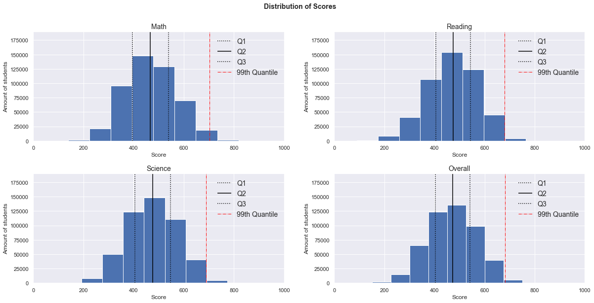
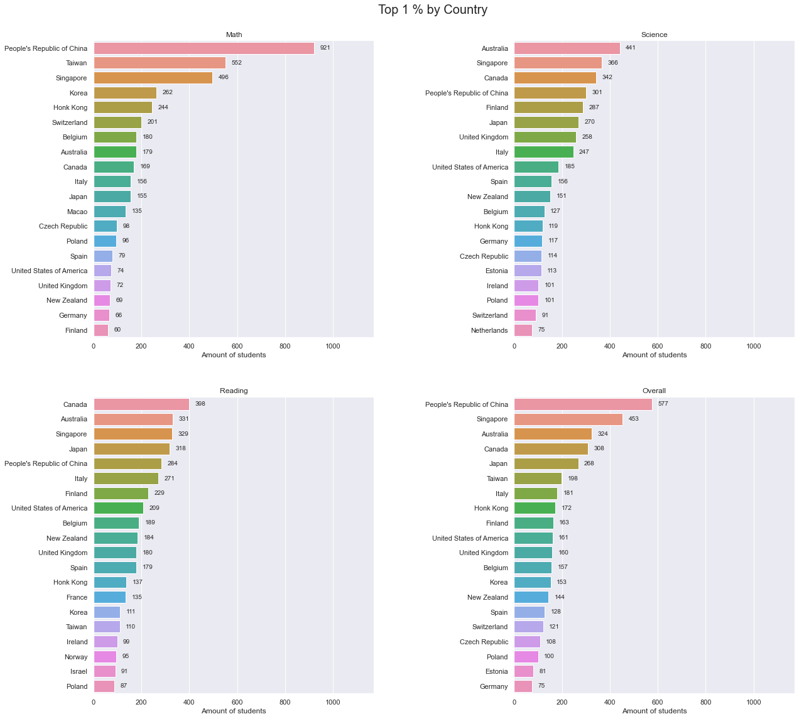

# PISA 2012
## by Lukas Jakson

**Table of Contents**

- [1. Introduction](#introduction)
- [2. Structure of PISA2012 dataset](#structure-dataset)
- [3. Questions](#questions)
- [4. Data Wrangling](#data-wrangling)
- [5. Univariate Exploration](#univariate-exploration)
- [6. Bivariate Exploration](#bivariate-exploration)
- [7. Multivariate Exploration](#multivariate-exploration)
- [8. Conclusion](#conclusion)

## 1. Introduction to PISA

**What Is PISA?**

The Program for International Student Assessment (PISA) is a system of international assessments
that allows countries to compare outcomes of learning as students near the end of compulsory
schooling. PISA core assessments measure the performance of 15-year-old students in mathematics,
science, and reading literacy every 3 years. Coordinated by the Organization for Economic
Cooperation and Development (OECD), PISA was first implemented in 2000 in 32 countries.
It has since grown to 65 education systems in 2012.

**What PISA Measures**

PISA’s goal is to assess students’ preparation for the challenges of life as young adults. PISA assesses
the application of knowledge in mathematics, science, and reading literacy to problems within a reallife context (OECD 1999). PISA does not focus explicitly on curricular outcomes and uses the term
“literacy” in each subject area to indicate its broad focus on the application of knowledge and skills.
For example, when assessing mathematics, PISA examines how well 15-year-old students can
understand, use, and reflect on mathematics for a variety of real-life problems and settings that
they may not encounter in the classroom. Scores on the PISA scales represent skill levels along a
continuum of literacy skills.
Each PISA data collection cycle assesses one of the three core subject areas in depth (considered the
major subject area), although all three core subjects are assessed in each cycle (the other two subjects
are considered minor subject areas for that assessment year). Assessing all three subjects every 3 years
allows countries to have a consistent source of achievement data in each of the three subjects, while
rotating one area as the primary focus over the years. Mathematics was the major subject area in
2012, as it was in 2003, since each subject is a major subject area once every three cycles. In 2012,
mathematics, science, and reading literacy were assessed primarily through a paper-and-pencil
assessment, and problem solving was administered via a computer-based assessment. In addition to
these core assessments, education systems could participate in optional paper-based financial literacy
and computer-based mathematics and reading assessments. The United States participated in these
optional assessments. Visit www.nces.ed.gov/surveys/pisa for more information on the PISA
assessments, including information on how the assessments were designed and examples of
PISA questions.

Source: https://nces.ed.gov/pubs2014/2014024rev.pdf

## 2. Structure of PISA2012 dataset
The original data set contains 485.490 students and 636 features. In order to identify the features that are interesting for us, we will begin to wrangle our data first. 

<table border="1" class="dataframe">
  <thead>
    <tr style="text-align: right;">
      <th></th>
      <th>Unnamed: 0</th>
      <th>CNT</th>
      <th>SUBNATIO</th>
      <th>STRATUM</th>
      <th>OECD</th>
      <th>NC</th>
      <th>SCHOOLID</th>
      <th>STIDSTD</th>
      <th>ST01Q01</th>
      <th>ST02Q01</th>
      <th>ST03Q01</th>
      <th>ST03Q02</th>
      <th>ST04Q01</th>
      <th>ST05Q01</th>
      <th>ST06Q01</th>
      <th>ST07Q01</th>
      <th>ST07Q02</th>
      <th>ST07Q03</th>
      <th>ST08Q01</th>
      <th>ST09Q01</th>
      <th>ST115Q01</th>
      <th>ST11Q01</th>
      <th>ST11Q02</th>
      <th>ST11Q03</th>
      <th>ST11Q04</th>
      <th>ST11Q05</th>
      <th>ST11Q06</th>
      <th>ST13Q01</th>
      <th>ST14Q01</th>
      <th>ST14Q02</th>
      <th>ST14Q03</th>
      <th>ST14Q04</th>
      <th>ST15Q01</th>
      <th>ST17Q01</th>
      <th>ST18Q01</th>
      <th>ST18Q02</th>
      <th>ST18Q03</th>
      <th>ST18Q04</th>
      <th>ST19Q01</th>
      <th>ST20Q01</th>
      <th>ST20Q02</th>
      <th>ST20Q03</th>
      <th>ST21Q01</th>
      <th>ST25Q01</th>
      <th>ST26Q01</th>
      <th>ST26Q02</th>
      <th>ST26Q03</th>
      <th>ST26Q04</th>
      <th>ST26Q05</th>
      <th>ST26Q06</th>
      <th>ST26Q07</th>
      <th>ST26Q08</th>
      <th>ST26Q09</th>
      <th>ST26Q10</th>
      <th>ST26Q11</th>
      <th>ST26Q12</th>
      <th>ST26Q13</th>
      <th>ST26Q14</th>
      <th>ST26Q15</th>
      <th>ST26Q16</th>
      <th>ST26Q17</th>
      <th>ST27Q01</th>
      <th>ST27Q02</th>
      <th>ST27Q03</th>
      <th>ST27Q04</th>
      <th>ST27Q05</th>
      <th>ST28Q01</th>
      <th>ST29Q01</th>
      <th>ST29Q02</th>
      <th>ST29Q03</th>
      <th>ST29Q04</th>
      <th>ST29Q05</th>
      <th>ST29Q06</th>
      <th>ST29Q07</th>
      <th>ST29Q08</th>
      <th>ST35Q01</th>
      <th>ST35Q02</th>
      <th>ST35Q03</th>
      <th>ST35Q04</th>
      <th>ST35Q05</th>
      <th>ST35Q06</th>
      <th>ST37Q01</th>
      <th>ST37Q02</th>
      <th>ST37Q03</th>
      <th>ST37Q04</th>
      <th>ST37Q05</th>
      <th>ST37Q06</th>
      <th>ST37Q07</th>
      <th>ST37Q08</th>
      <th>ST42Q01</th>
      <th>ST42Q02</th>
      <th>ST42Q03</th>
      <th>ST42Q04</th>
      <th>ST42Q05</th>
      <th>ST42Q06</th>
      <th>ST42Q07</th>
      <th>ST42Q08</th>
      <th>ST42Q09</th>
      <th>ST42Q10</th>
      <th>ST43Q01</th>
      <th>ST43Q02</th>
      <th>ST43Q03</th>
      <th>ST43Q04</th>
      <th>ST43Q05</th>
      <th>ST43Q06</th>
      <th>ST44Q01</th>
      <th>ST44Q03</th>
      <th>ST44Q04</th>
      <th>ST44Q05</th>
      <th>ST44Q07</th>
      <th>ST44Q08</th>
      <th>ST46Q01</th>
      <th>ST46Q02</th>
      <th>ST46Q03</th>
      <th>ST46Q04</th>
      <th>ST46Q05</th>
      <th>ST46Q06</th>
      <th>ST46Q07</th>
      <th>ST46Q08</th>
      <th>ST46Q09</th>
      <th>ST48Q01</th>
      <th>ST48Q02</th>
      <th>ST48Q03</th>
      <th>ST48Q04</th>
      <th>ST48Q05</th>
      <th>ST49Q01</th>
      <th>ST49Q02</th>
      <th>ST49Q03</th>
      <th>ST49Q04</th>
      <th>ST49Q05</th>
      <th>ST49Q06</th>
      <th>ST49Q07</th>
      <th>ST49Q09</th>
      <th>ST53Q01</th>
      <th>ST53Q02</th>
      <th>ST53Q03</th>
      <th>ST53Q04</th>
      <th>ST55Q01</th>
      <th>ST55Q02</th>
      <th>ST55Q03</th>
      <th>ST55Q04</th>
      <th>ST57Q01</th>
      <th>ST57Q02</th>
      <th>ST57Q03</th>
      <th>ST57Q04</th>
      <th>ST57Q05</th>
      <th>ST57Q06</th>
      <th>ST61Q01</th>
      <th>ST61Q02</th>
      <th>ST61Q03</th>
      <th>ST61Q04</th>
      <th>ST61Q05</th>
      <th>ST61Q06</th>
      <th>ST61Q07</th>
      <th>ST61Q08</th>
      <th>ST61Q09</th>
      <th>ST62Q01</th>
      <th>ST62Q02</th>
      <th>ST62Q03</th>
      <th>ST62Q04</th>
      <th>ST62Q06</th>
      <th>ST62Q07</th>
      <th>ST62Q08</th>
      <th>ST62Q09</th>
      <th>ST62Q10</th>
      <th>ST62Q11</th>
      <th>ST62Q12</th>
      <th>ST62Q13</th>
      <th>ST62Q15</th>
      <th>ST62Q16</th>
      <th>ST62Q17</th>
      <th>ST62Q19</th>
      <th>ST69Q01</th>
      <th>ST69Q02</th>
      <th>ST69Q03</th>
      <th>ST70Q01</th>
      <th>ST70Q02</th>
      <th>ST70Q03</th>
      <th>ST71Q01</th>
      <th>ST72Q01</th>
      <th>ST73Q01</th>
      <th>ST73Q02</th>
      <th>ST74Q01</th>
      <th>ST74Q02</th>
      <th>ST75Q01</th>
      <th>ST75Q02</th>
      <th>ST76Q01</th>
      <th>ST76Q02</th>
      <th>ST77Q01</th>
      <th>ST77Q02</th>
      <th>ST77Q04</th>
      <th>ST77Q05</th>
      <th>ST77Q06</th>
      <th>ST79Q01</th>
      <th>ST79Q02</th>
      <th>ST79Q03</th>
      <th>ST79Q04</th>
      <th>ST79Q05</th>
      <th>ST79Q06</th>
      <th>ST79Q07</th>
      <th>ST79Q08</th>
      <th>ST79Q10</th>
      <th>ST79Q11</th>
      <th>ST79Q12</th>
      <th>ST79Q15</th>
      <th>ST79Q17</th>
      <th>ST80Q01</th>
      <th>ST80Q04</th>
      <th>ST80Q05</th>
      <th>ST80Q06</th>
      <th>ST80Q07</th>
      <th>ST80Q08</th>
      <th>ST80Q09</th>
      <th>ST80Q10</th>
      <th>ST80Q11</th>
      <th>ST81Q01</th>
      <th>ST81Q02</th>
      <th>ST81Q03</th>
      <th>ST81Q04</th>
      <th>ST81Q05</th>
      <th>ST82Q01</th>
      <th>ST82Q02</th>
      <th>ST82Q03</th>
      <th>ST83Q01</th>
      <th>ST83Q02</th>
      <th>ST83Q03</th>
      <th>ST83Q04</th>
      <th>ST84Q01</th>
      <th>ST84Q02</th>
      <th>ST84Q03</th>
      <th>ST85Q01</th>
      <th>ST85Q02</th>
      <th>ST85Q03</th>
      <th>ST85Q04</th>
      <th>ST86Q01</th>
      <th>ST86Q02</th>
      <th>ST86Q03</th>
      <th>ST86Q04</th>
      <th>ST86Q05</th>
      <th>ST87Q01</th>
      <th>ST87Q02</th>
      <th>ST87Q03</th>
      <th>ST87Q04</th>
      <th>ST87Q05</th>
      <th>ST87Q06</th>
      <th>ST87Q07</th>
      <th>ST87Q08</th>
      <th>ST87Q09</th>
      <th>ST88Q01</th>
      <th>ST88Q02</th>
      <th>ST88Q03</th>
      <th>ST88Q04</th>
      <th>ST89Q02</th>
      <th>ST89Q03</th>
      <th>ST89Q04</th>
      <th>ST89Q05</th>
      <th>ST91Q01</th>
      <th>ST91Q02</th>
      <th>ST91Q03</th>
      <th>ST91Q04</th>
      <th>ST91Q05</th>
      <th>ST91Q06</th>
      <th>ST93Q01</th>
      <th>ST93Q03</th>
      <th>ST93Q04</th>
      <th>ST93Q06</th>
      <th>ST93Q07</th>
      <th>ST94Q05</th>
      <th>ST94Q06</th>
      <th>ST94Q09</th>
      <th>ST94Q10</th>
      <th>ST94Q14</th>
      <th>ST96Q01</th>
      <th>ST96Q02</th>
      <th>ST96Q03</th>
      <th>ST96Q05</th>
      <th>ST101Q01</th>
      <th>ST101Q02</th>
      <th>ST101Q03</th>
      <th>ST101Q05</th>
      <th>ST104Q01</th>
      <th>ST104Q04</th>
      <th>ST104Q05</th>
      <th>ST104Q06</th>
      <th>IC01Q01</th>
      <th>IC01Q02</th>
      <th>IC01Q03</th>
      <th>IC01Q04</th>
      <th>IC01Q05</th>
      <th>IC01Q06</th>
      <th>IC01Q07</th>
      <th>IC01Q08</th>
      <th>IC01Q09</th>
      <th>IC01Q10</th>
      <th>IC01Q11</th>
      <th>IC02Q01</th>
      <th>IC02Q02</th>
      <th>IC02Q03</th>
      <th>IC02Q04</th>
      <th>IC02Q05</th>
      <th>IC02Q06</th>
      <th>IC02Q07</th>
      <th>IC03Q01</th>
      <th>IC04Q01</th>
      <th>IC05Q01</th>
      <th>IC06Q01</th>
      <th>IC07Q01</th>
      <th>IC08Q01</th>
      <th>IC08Q02</th>
      <th>IC08Q03</th>
      <th>IC08Q04</th>
      <th>IC08Q05</th>
      <th>IC08Q06</th>
      <th>IC08Q07</th>
      <th>IC08Q08</th>
      <th>IC08Q09</th>
      <th>IC08Q11</th>
      <th>IC09Q01</th>
      <th>IC09Q02</th>
      <th>IC09Q03</th>
      <th>IC09Q04</th>
      <th>IC09Q05</th>
      <th>IC09Q06</th>
      <th>IC09Q07</th>
      <th>IC10Q01</th>
      <th>IC10Q02</th>
      <th>IC10Q03</th>
      <th>IC10Q04</th>
      <th>IC10Q05</th>
      <th>IC10Q06</th>
      <th>IC10Q07</th>
      <th>IC10Q08</th>
      <th>IC10Q09</th>
      <th>IC11Q01</th>
      <th>IC11Q02</th>
      <th>IC11Q03</th>
      <th>IC11Q04</th>
      <th>IC11Q05</th>
      <th>IC11Q06</th>
      <th>IC11Q07</th>
      <th>IC22Q01</th>
      <th>IC22Q02</th>
      <th>IC22Q04</th>
      <th>IC22Q06</th>
      <th>IC22Q07</th>
      <th>IC22Q08</th>
      <th>EC01Q01</th>
      <th>EC02Q01</th>
      <th>EC03Q01</th>
      <th>EC03Q02</th>
      <th>EC03Q03</th>
      <th>EC03Q04</th>
      <th>EC03Q05</th>
      <th>EC03Q06</th>
      <th>EC03Q07</th>
      <th>EC03Q08</th>
      <th>EC03Q09</th>
      <th>EC03Q10</th>
      <th>EC04Q01A</th>
      <th>EC04Q01B</th>
      <th>EC04Q01C</th>
      <th>EC04Q02A</th>
      <th>EC04Q02B</th>
      <th>EC04Q02C</th>
      <th>EC04Q03A</th>
      <th>EC04Q03B</th>
      <th>EC04Q03C</th>
      <th>EC04Q04A</th>
      <th>EC04Q04B</th>
      <th>EC04Q04C</th>
      <th>EC04Q05A</th>
      <th>EC04Q05B</th>
      <th>EC04Q05C</th>
      <th>EC04Q06A</th>
      <th>EC04Q06B</th>
      <th>EC04Q06C</th>
      <th>EC05Q01</th>
      <th>EC06Q01</th>
      <th>EC07Q01</th>
      <th>EC07Q02</th>
      <th>EC07Q03</th>
      <th>EC07Q04</th>
      <th>EC07Q05</th>
      <th>EC08Q01</th>
      <th>EC08Q02</th>
      <th>EC08Q03</th>
      <th>EC08Q04</th>
      <th>EC09Q03</th>
      <th>EC10Q01</th>
      <th>EC11Q02</th>
      <th>EC11Q03</th>
      <th>EC12Q01</th>
      <th>ST22Q01</th>
      <th>ST23Q01</th>
      <th>ST23Q02</th>
      <th>ST23Q03</th>
      <th>ST23Q04</th>
      <th>ST23Q05</th>
      <th>ST23Q06</th>
      <th>ST23Q07</th>
      <th>ST23Q08</th>
      <th>ST24Q01</th>
      <th>ST24Q02</th>
      <th>ST24Q03</th>
      <th>CLCUSE1</th>
      <th>CLCUSE301</th>
      <th>CLCUSE302</th>
      <th>DEFFORT</th>
      <th>QUESTID</th>
      <th>BOOKID</th>
      <th>EASY</th>
      <th>AGE</th>
      <th>GRADE</th>
      <th>PROGN</th>
      <th>ANXMAT</th>
      <th>ATSCHL</th>
      <th>ATTLNACT</th>
      <th>BELONG</th>
      <th>BFMJ2</th>
      <th>BMMJ1</th>
      <th>CLSMAN</th>
      <th>COBN_F</th>
      <th>COBN_M</th>
      <th>COBN_S</th>
      <th>COGACT</th>
      <th>CULTDIST</th>
      <th>CULTPOS</th>
      <th>DISCLIMA</th>
      <th>ENTUSE</th>
      <th>ESCS</th>
      <th>EXAPPLM</th>
      <th>EXPUREM</th>
      <th>FAILMAT</th>
      <th>FAMCON</th>
      <th>FAMCONC</th>
      <th>FAMSTRUC</th>
      <th>FISCED</th>
      <th>HEDRES</th>
      <th>HERITCUL</th>
      <th>HISCED</th>
      <th>HISEI</th>
      <th>HOMEPOS</th>
      <th>HOMSCH</th>
      <th>HOSTCUL</th>
      <th>ICTATTNEG</th>
      <th>ICTATTPOS</th>
      <th>ICTHOME</th>
      <th>ICTRES</th>
      <th>ICTSCH</th>
      <th>IMMIG</th>
      <th>INFOCAR</th>
      <th>INFOJOB1</th>
      <th>INFOJOB2</th>
      <th>INSTMOT</th>
      <th>INTMAT</th>
      <th>ISCEDD</th>
      <th>ISCEDL</th>
      <th>ISCEDO</th>
      <th>LANGCOMM</th>
      <th>LANGN</th>
      <th>LANGRPPD</th>
      <th>LMINS</th>
      <th>MATBEH</th>
      <th>MATHEFF</th>
      <th>MATINTFC</th>
      <th>MATWKETH</th>
      <th>MISCED</th>
      <th>MMINS</th>
      <th>MTSUP</th>
      <th>OCOD1</th>
      <th>OCOD2</th>
      <th>OPENPS</th>
      <th>OUTHOURS</th>
      <th>PARED</th>
      <th>PERSEV</th>
      <th>REPEAT</th>
      <th>SCMAT</th>
      <th>SMINS</th>
      <th>STUDREL</th>
      <th>SUBNORM</th>
      <th>TCHBEHFA</th>
      <th>TCHBEHSO</th>
      <th>TCHBEHTD</th>
      <th>TEACHSUP</th>
      <th>TESTLANG</th>
      <th>TIMEINT</th>
      <th>USEMATH</th>
      <th>USESCH</th>
      <th>WEALTH</th>
      <th>ANCATSCHL</th>
      <th>ANCATTLNACT</th>
      <th>ANCBELONG</th>
      <th>ANCCLSMAN</th>
      <th>ANCCOGACT</th>
      <th>ANCINSTMOT</th>
      <th>ANCINTMAT</th>
      <th>ANCMATWKETH</th>
      <th>ANCMTSUP</th>
      <th>ANCSCMAT</th>
      <th>ANCSTUDREL</th>
      <th>ANCSUBNORM</th>
      <th>PV1MATH</th>
      <th>PV2MATH</th>
      <th>PV3MATH</th>
      <th>PV4MATH</th>
      <th>PV5MATH</th>
      <th>PV1MACC</th>
      <th>PV2MACC</th>
      <th>PV3MACC</th>
      <th>PV4MACC</th>
      <th>PV5MACC</th>
      <th>PV1MACQ</th>
      <th>PV2MACQ</th>
      <th>PV3MACQ</th>
      <th>PV4MACQ</th>
      <th>PV5MACQ</th>
      <th>PV1MACS</th>
      <th>PV2MACS</th>
      <th>PV3MACS</th>
      <th>PV4MACS</th>
      <th>PV5MACS</th>
      <th>PV1MACU</th>
      <th>PV2MACU</th>
      <th>PV3MACU</th>
      <th>PV4MACU</th>
      <th>PV5MACU</th>
      <th>PV1MAPE</th>
      <th>PV2MAPE</th>
      <th>PV3MAPE</th>
      <th>PV4MAPE</th>
      <th>PV5MAPE</th>
      <th>PV1MAPF</th>
      <th>PV2MAPF</th>
      <th>PV3MAPF</th>
      <th>PV4MAPF</th>
      <th>PV5MAPF</th>
      <th>PV1MAPI</th>
      <th>PV2MAPI</th>
      <th>PV3MAPI</th>
      <th>PV4MAPI</th>
      <th>PV5MAPI</th>
      <th>PV1READ</th>
      <th>PV2READ</th>
      <th>PV3READ</th>
      <th>PV4READ</th>
      <th>PV5READ</th>
      <th>PV1SCIE</th>
      <th>PV2SCIE</th>
      <th>PV3SCIE</th>
      <th>PV4SCIE</th>
      <th>PV5SCIE</th>
      <th>W_FSTUWT</th>
      <th>W_FSTR1</th>
      <th>W_FSTR2</th>
      <th>W_FSTR3</th>
      <th>W_FSTR4</th>
      <th>W_FSTR5</th>
      <th>W_FSTR6</th>
      <th>W_FSTR7</th>
      <th>W_FSTR8</th>
      <th>W_FSTR9</th>
      <th>W_FSTR10</th>
      <th>W_FSTR11</th>
      <th>W_FSTR12</th>
      <th>W_FSTR13</th>
      <th>W_FSTR14</th>
      <th>W_FSTR15</th>
      <th>W_FSTR16</th>
      <th>W_FSTR17</th>
      <th>W_FSTR18</th>
      <th>W_FSTR19</th>
      <th>W_FSTR20</th>
      <th>W_FSTR21</th>
      <th>W_FSTR22</th>
      <th>W_FSTR23</th>
      <th>W_FSTR24</th>
      <th>W_FSTR25</th>
      <th>W_FSTR26</th>
      <th>W_FSTR27</th>
      <th>W_FSTR28</th>
      <th>W_FSTR29</th>
      <th>W_FSTR30</th>
      <th>W_FSTR31</th>
      <th>W_FSTR32</th>
      <th>W_FSTR33</th>
      <th>W_FSTR34</th>
      <th>W_FSTR35</th>
      <th>W_FSTR36</th>
      <th>W_FSTR37</th>
      <th>W_FSTR38</th>
      <th>W_FSTR39</th>
      <th>W_FSTR40</th>
      <th>W_FSTR41</th>
      <th>W_FSTR42</th>
      <th>W_FSTR43</th>
      <th>W_FSTR44</th>
      <th>W_FSTR45</th>
      <th>W_FSTR46</th>
      <th>W_FSTR47</th>
      <th>W_FSTR48</th>
      <th>W_FSTR49</th>
      <th>W_FSTR50</th>
      <th>W_FSTR51</th>
      <th>W_FSTR52</th>
      <th>W_FSTR53</th>
      <th>W_FSTR54</th>
      <th>W_FSTR55</th>
      <th>W_FSTR56</th>
      <th>W_FSTR57</th>
      <th>W_FSTR58</th>
      <th>W_FSTR59</th>
      <th>W_FSTR60</th>
      <th>W_FSTR61</th>
      <th>W_FSTR62</th>
      <th>W_FSTR63</th>
      <th>W_FSTR64</th>
      <th>W_FSTR65</th>
      <th>W_FSTR66</th>
      <th>W_FSTR67</th>
      <th>W_FSTR68</th>
      <th>W_FSTR69</th>
      <th>W_FSTR70</th>
      <th>W_FSTR71</th>
      <th>W_FSTR72</th>
      <th>W_FSTR73</th>
      <th>W_FSTR74</th>
      <th>W_FSTR75</th>
      <th>W_FSTR76</th>
      <th>W_FSTR77</th>
      <th>W_FSTR78</th>
      <th>W_FSTR79</th>
      <th>W_FSTR80</th>
      <th>WVARSTRR</th>
      <th>VAR_UNIT</th>
      <th>SENWGT_STU</th>
      <th>VER_STU</th>
    </tr>
  </thead>
  <tbody>
    <tr>
      <th>0</th>
      <td>1</td>
      <td>Albania</td>
      <td>80000</td>
      <td>ALB0006</td>
      <td>Non-OECD</td>
      <td>Albania</td>
      <td>1</td>
      <td>1</td>
      <td>10</td>
      <td>1.0</td>
      <td>2</td>
      <td>1996</td>
      <td>Female</td>
      <td>No</td>
      <td>6.0</td>
      <td>No, never</td>
      <td>No, never</td>
      <td>No, never</td>
      <td>None</td>
      <td>None</td>
      <td>1.0</td>
      <td>Yes</td>
      <td>Yes</td>
      <td>Yes</td>
      <td>Yes</td>
      <td>NaN</td>
      <td>NaN</td>
      <td>&lt;ISCED level 3A&gt;</td>
      <td>No</td>
      <td>No</td>
      <td>No</td>
      <td>No</td>
      <td>Other (e.g. home duties, retired)</td>
      <td>&lt;ISCED level 3A&gt;</td>
      <td>NaN</td>
      <td>NaN</td>
      <td>NaN</td>
      <td>NaN</td>
      <td>Working part-time &lt;for pay&gt;</td>
      <td>Country of test</td>
      <td>Country of test</td>
      <td>Country of test</td>
      <td>NaN</td>
      <td>Language of the test</td>
      <td>Yes</td>
      <td>No</td>
      <td>Yes</td>
      <td>No</td>
      <td>No</td>
      <td>No</td>
      <td>No</td>
      <td>Yes</td>
      <td>No</td>
      <td>Yes</td>
      <td>No</td>
      <td>Yes</td>
      <td>No</td>
      <td>Yes</td>
      <td>8002</td>
      <td>8001</td>
      <td>8002</td>
      <td>Two</td>
      <td>One</td>
      <td>None</td>
      <td>None</td>
      <td>None</td>
      <td>0-10 books</td>
      <td>Agree</td>
      <td>Strongly agree</td>
      <td>Agree</td>
      <td>Agree</td>
      <td>Agree</td>
      <td>Agree</td>
      <td>Agree</td>
      <td>Strongly agree</td>
      <td>Disagree</td>
      <td>Agree</td>
      <td>Disagree</td>
      <td>Agree</td>
      <td>Agree</td>
      <td>Agree</td>
      <td>Not at all confident</td>
      <td>Not very confident</td>
      <td>Confident</td>
      <td>Confident</td>
      <td>Confident</td>
      <td>Not at all confident</td>
      <td>Confident</td>
      <td>Very confident</td>
      <td>Agree</td>
      <td>Disagree</td>
      <td>Agree</td>
      <td>Agree</td>
      <td>Agree</td>
      <td>Agree</td>
      <td>Agree</td>
      <td>Disagree</td>
      <td>Disagree</td>
      <td>Disagree</td>
      <td>Agree</td>
      <td>Disagree</td>
      <td>Disagree</td>
      <td>Agree</td>
      <td>NaN</td>
      <td>Disagree</td>
      <td>Likely</td>
      <td>Slightly likely</td>
      <td>Likely</td>
      <td>Likely</td>
      <td>Likely</td>
      <td>Very   Likely</td>
      <td>Agree</td>
      <td>Agree</td>
      <td>Agree</td>
      <td>Agree</td>
      <td>Agree</td>
      <td>Agree</td>
      <td>Agree</td>
      <td>Agree</td>
      <td>Agree</td>
      <td>Courses after school Test Language</td>
      <td>Major in college Science</td>
      <td>Study harder Test Language</td>
      <td>Maximum classes Science</td>
      <td>Pursuing a career Math</td>
      <td>Often</td>
      <td>Sometimes</td>
      <td>Sometimes</td>
      <td>Sometimes</td>
      <td>Sometimes</td>
      <td>Never or rarely</td>
      <td>Never or rarely</td>
      <td>Never or rarely</td>
      <td>NaN</td>
      <td>NaN</td>
      <td>NaN</td>
      <td>NaN</td>
      <td>NaN</td>
      <td>NaN</td>
      <td>NaN</td>
      <td>NaN</td>
      <td>NaN</td>
      <td>NaN</td>
      <td>NaN</td>
      <td>NaN</td>
      <td>NaN</td>
      <td>NaN</td>
      <td>NaN</td>
      <td>NaN</td>
      <td>NaN</td>
      <td>NaN</td>
      <td>NaN</td>
      <td>NaN</td>
      <td>NaN</td>
      <td>NaN</td>
      <td>NaN</td>
      <td>NaN</td>
      <td>NaN</td>
      <td>NaN</td>
      <td>NaN</td>
      <td>NaN</td>
      <td>NaN</td>
      <td>NaN</td>
      <td>NaN</td>
      <td>NaN</td>
      <td>NaN</td>
      <td>NaN</td>
      <td>NaN</td>
      <td>NaN</td>
      <td>NaN</td>
      <td>NaN</td>
      <td>NaN</td>
      <td>NaN</td>
      <td>NaN</td>
      <td>NaN</td>
      <td>NaN</td>
      <td>NaN</td>
      <td>NaN</td>
      <td>NaN</td>
      <td>NaN</td>
      <td>NaN</td>
      <td>NaN</td>
      <td>NaN</td>
      <td>NaN</td>
      <td>NaN</td>
      <td>NaN</td>
      <td>NaN</td>
      <td>NaN</td>
      <td>Every Lesson</td>
      <td>Every Lesson</td>
      <td>Every Lesson</td>
      <td>Every Lesson</td>
      <td>Every Lesson</td>
      <td>Never or Hardly Ever</td>
      <td>Most Lessons</td>
      <td>Never or Hardly Ever</td>
      <td>Every Lesson</td>
      <td>Most Lessons</td>
      <td>Every Lesson</td>
      <td>Every Lesson</td>
      <td>Every Lesson</td>
      <td>Never or Hardly Ever</td>
      <td>Most Lessons</td>
      <td>Every Lesson</td>
      <td>Every Lesson</td>
      <td>Every Lesson</td>
      <td>Always or almost always</td>
      <td>Sometimes</td>
      <td>Never or rarely</td>
      <td>Always or almost always</td>
      <td>Always or almost always</td>
      <td>Always or almost always</td>
      <td>Always or almost always</td>
      <td>Often</td>
      <td>Often</td>
      <td>Never or Hardly Ever</td>
      <td>Never or Hardly Ever</td>
      <td>Never or Hardly Ever</td>
      <td>Never or Hardly Ever</td>
      <td>Never or Hardly Ever</td>
      <td>Strongly disagree</td>
      <td>Strongly disagree</td>
      <td>Strongly disagree</td>
      <td>Strongly disagree</td>
      <td>Agree</td>
      <td>Agree</td>
      <td>Agree</td>
      <td>Strongly agree</td>
      <td>Strongly agree</td>
      <td>Disagree</td>
      <td>Agree</td>
      <td>Strongly disagree</td>
      <td>Disagree</td>
      <td>Agree</td>
      <td>Agree</td>
      <td>Strongly disagree</td>
      <td>Agree</td>
      <td>Agree</td>
      <td>Disagree</td>
      <td>Agree</td>
      <td>Agree</td>
      <td>Strongly disagree</td>
      <td>Strongly agree</td>
      <td>Strongly agree</td>
      <td>Strongly disagree</td>
      <td>Agree</td>
      <td>Strongly disagree</td>
      <td>Agree</td>
      <td>Agree</td>
      <td>Strongly agree</td>
      <td>Strongly disagree</td>
      <td>Strongly disagree</td>
      <td>Agree</td>
      <td>Strongly agree</td>
      <td>Strongly agree</td>
      <td>Strongly agree</td>
      <td>Strongly agree</td>
      <td>Strongly agree</td>
      <td>Strongly agree</td>
      <td>Strongly disagree</td>
      <td>Disagree</td>
      <td>Strongly disagree</td>
      <td>Very much like me</td>
      <td>Very much like me</td>
      <td>Very much like me</td>
      <td>Somewhat like me</td>
      <td>Very much like me</td>
      <td>Somewhat like me</td>
      <td>Mostly like me</td>
      <td>Mostly like me</td>
      <td>Mostly like me</td>
      <td>Somewhat like me</td>
      <td>definitely do this</td>
      <td>definitely do this</td>
      <td>definitely do this</td>
      <td>definitely do this</td>
      <td>4.0</td>
      <td>2.0</td>
      <td>1.0</td>
      <td>1.0</td>
      <td>1.0</td>
      <td>2.0</td>
      <td>1.0</td>
      <td>1.0</td>
      <td>NaN</td>
      <td>NaN</td>
      <td>NaN</td>
      <td>NaN</td>
      <td>NaN</td>
      <td>NaN</td>
      <td>NaN</td>
      <td>NaN</td>
      <td>NaN</td>
      <td>NaN</td>
      <td>NaN</td>
      <td>NaN</td>
      <td>NaN</td>
      <td>NaN</td>
      <td>NaN</td>
      <td>NaN</td>
      <td>NaN</td>
      <td>NaN</td>
      <td>NaN</td>
      <td>NaN</td>
      <td>99</td>
      <td>99</td>
      <td>99</td>
      <td>NaN</td>
      <td>NaN</td>
      <td>NaN</td>
      <td>NaN</td>
      <td>NaN</td>
      <td>NaN</td>
      <td>NaN</td>
      <td>NaN</td>
      <td>NaN</td>
      <td>NaN</td>
      <td>NaN</td>
      <td>NaN</td>
      <td>NaN</td>
      <td>NaN</td>
      <td>NaN</td>
      <td>NaN</td>
      <td>NaN</td>
      <td>NaN</td>
      <td>NaN</td>
      <td>NaN</td>
      <td>NaN</td>
      <td>NaN</td>
      <td>NaN</td>
      <td>NaN</td>
      <td>NaN</td>
      <td>NaN</td>
      <td>NaN</td>
      <td>NaN</td>
      <td>NaN</td>
      <td>NaN</td>
      <td>NaN</td>
      <td>NaN</td>
      <td>NaN</td>
      <td>NaN</td>
      <td>NaN</td>
      <td>NaN</td>
      <td>NaN</td>
      <td>NaN</td>
      <td>NaN</td>
      <td>NaN</td>
      <td>NaN</td>
      <td>NaN</td>
      <td>NaN</td>
      <td>NaN</td>
      <td>NaN</td>
      <td>NaN</td>
      <td>NaN</td>
      <td>NaN</td>
      <td>NaN</td>
      <td>NaN</td>
      <td>NaN</td>
      <td>NaN</td>
      <td>NaN</td>
      <td>NaN</td>
      <td>NaN</td>
      <td>NaN</td>
      <td>NaN</td>
      <td>NaN</td>
      <td>NaN</td>
      <td>NaN</td>
      <td>NaN</td>
      <td>NaN</td>
      <td>NaN</td>
      <td>NaN</td>
      <td>NaN</td>
      <td>NaN</td>
      <td>NaN</td>
      <td>NaN</td>
      <td>NaN</td>
      <td>NaN</td>
      <td>NaN</td>
      <td>NaN</td>
      <td>NaN</td>
      <td>NaN</td>
      <td>NaN</td>
      <td>NaN</td>
      <td>NaN</td>
      <td>NaN</td>
      <td>NaN</td>
      <td>NaN</td>
      <td>NaN</td>
      <td>NaN</td>
      <td>NaN</td>
      <td>NaN</td>
      <td>NaN</td>
      <td>NaN</td>
      <td>NaN</td>
      <td>NaN</td>
      <td>NaN</td>
      <td>NaN</td>
      <td>NaN</td>
      <td>NaN</td>
      <td>NaN</td>
      <td>NaN</td>
      <td>NaN</td>
      <td>NaN</td>
      <td>NaN</td>
      <td>A Simple calculator</td>
      <td>99</td>
      <td>99</td>
      <td>99</td>
      <td>StQ Form B</td>
      <td>booklet 7</td>
      <td>Standard set of booklets</td>
      <td>16.17</td>
      <td>0.0</td>
      <td>Albania: Upper secondary education</td>
      <td>0.32</td>
      <td>-2.31</td>
      <td>0.5206</td>
      <td>-1.18</td>
      <td>76.49</td>
      <td>79.74</td>
      <td>-1.3771</td>
      <td>Albania</td>
      <td>Albania</td>
      <td>Albania</td>
      <td>0.6994</td>
      <td>NaN</td>
      <td>-0.48</td>
      <td>1.85</td>
      <td>NaN</td>
      <td>NaN</td>
      <td>NaN</td>
      <td>NaN</td>
      <td>0.6400</td>
      <td>NaN</td>
      <td>NaN</td>
      <td>2.0</td>
      <td>ISCED 3A, ISCED 4</td>
      <td>-1.29</td>
      <td>NaN</td>
      <td>ISCED 3A, ISCED 4</td>
      <td>NaN</td>
      <td>-2.61</td>
      <td>NaN</td>
      <td>NaN</td>
      <td>NaN</td>
      <td>NaN</td>
      <td>NaN</td>
      <td>-3.16</td>
      <td>NaN</td>
      <td>Native</td>
      <td>NaN</td>
      <td>NaN</td>
      <td>NaN</td>
      <td>0.80</td>
      <td>0.91</td>
      <td>A</td>
      <td>ISCED level 3</td>
      <td>General</td>
      <td>NaN</td>
      <td>Albanian</td>
      <td>NaN</td>
      <td>NaN</td>
      <td>0.6426</td>
      <td>-0.77</td>
      <td>-0.7332</td>
      <td>0.2882</td>
      <td>ISCED 3A, ISCED 4</td>
      <td>NaN</td>
      <td>-0.9508</td>
      <td>Building architects</td>
      <td>Primary school teachers</td>
      <td>0.0521</td>
      <td>NaN</td>
      <td>12.0</td>
      <td>-0.3407</td>
      <td>Did not repeat a &lt;grade&gt;</td>
      <td>0.41</td>
      <td>NaN</td>
      <td>-1.04</td>
      <td>-0.0455</td>
      <td>1.3625</td>
      <td>0.9374</td>
      <td>0.4297</td>
      <td>1.68</td>
      <td>Albanian</td>
      <td>NaN</td>
      <td>NaN</td>
      <td>NaN</td>
      <td>-2.92</td>
      <td>-1.8636</td>
      <td>-0.6779</td>
      <td>-0.7351</td>
      <td>-0.7808</td>
      <td>-0.0219</td>
      <td>-0.1562</td>
      <td>0.0486</td>
      <td>-0.2199</td>
      <td>-0.5983</td>
      <td>-0.0807</td>
      <td>-0.5901</td>
      <td>-0.3346</td>
      <td>406.8469</td>
      <td>376.4683</td>
      <td>344.5319</td>
      <td>321.1637</td>
      <td>381.9209</td>
      <td>325.8374</td>
      <td>324.2795</td>
      <td>279.8800</td>
      <td>267.4170</td>
      <td>312.5954</td>
      <td>409.1837</td>
      <td>388.1524</td>
      <td>373.3525</td>
      <td>389.7102</td>
      <td>415.4152</td>
      <td>351.5423</td>
      <td>375.6894</td>
      <td>341.4161</td>
      <td>386.5945</td>
      <td>426.3203</td>
      <td>396.7207</td>
      <td>334.4057</td>
      <td>328.9531</td>
      <td>339.8582</td>
      <td>354.6580</td>
      <td>324.2795</td>
      <td>345.3108</td>
      <td>381.1419</td>
      <td>380.3630</td>
      <td>346.8687</td>
      <td>319.6059</td>
      <td>345.3108</td>
      <td>360.8895</td>
      <td>390.4892</td>
      <td>322.7216</td>
      <td>290.7852</td>
      <td>345.3108</td>
      <td>326.6163</td>
      <td>407.6258</td>
      <td>367.1210</td>
      <td>249.5762</td>
      <td>254.3420</td>
      <td>406.8496</td>
      <td>175.7053</td>
      <td>218.5981</td>
      <td>341.7009</td>
      <td>408.8400</td>
      <td>348.2283</td>
      <td>367.8105</td>
      <td>392.9877</td>
      <td>8.9096</td>
      <td>13.1249</td>
      <td>13.0829</td>
      <td>4.5315</td>
      <td>13.0829</td>
      <td>13.9235</td>
      <td>13.1249</td>
      <td>13.1249</td>
      <td>4.3389</td>
      <td>4.3313</td>
      <td>13.7954</td>
      <td>4.5315</td>
      <td>4.3313</td>
      <td>13.7954</td>
      <td>13.9235</td>
      <td>4.3389</td>
      <td>4.3313</td>
      <td>4.5084</td>
      <td>4.5084</td>
      <td>13.7954</td>
      <td>4.5315</td>
      <td>13.1249</td>
      <td>13.0829</td>
      <td>4.5315</td>
      <td>13.0829</td>
      <td>13.9235</td>
      <td>13.1249</td>
      <td>13.1249</td>
      <td>4.3389</td>
      <td>4.3313</td>
      <td>13.7954</td>
      <td>4.5315</td>
      <td>4.3313</td>
      <td>13.7954</td>
      <td>13.9235</td>
      <td>4.3389</td>
      <td>4.3313</td>
      <td>4.5084</td>
      <td>4.5084</td>
      <td>13.7954</td>
      <td>4.5315</td>
      <td>4.5084</td>
      <td>4.5315</td>
      <td>13.0829</td>
      <td>4.5315</td>
      <td>4.3313</td>
      <td>4.5084</td>
      <td>4.5084</td>
      <td>13.7954</td>
      <td>13.9235</td>
      <td>4.3389</td>
      <td>13.0829</td>
      <td>13.9235</td>
      <td>4.3389</td>
      <td>4.3313</td>
      <td>13.7954</td>
      <td>13.9235</td>
      <td>13.1249</td>
      <td>13.1249</td>
      <td>4.3389</td>
      <td>13.0829</td>
      <td>4.5084</td>
      <td>4.5315</td>
      <td>13.0829</td>
      <td>4.5315</td>
      <td>4.3313</td>
      <td>4.5084</td>
      <td>4.5084</td>
      <td>13.7954</td>
      <td>13.9235</td>
      <td>4.3389</td>
      <td>13.0829</td>
      <td>13.9235</td>
      <td>4.3389</td>
      <td>4.3313</td>
      <td>13.7954</td>
      <td>13.9235</td>
      <td>13.1249</td>
      <td>13.1249</td>
      <td>4.3389</td>
      <td>13.0829</td>
      <td>19</td>
      <td>1</td>
      <td>0.2098</td>
      <td>22NOV13</td>
    </tr>
    <tr>
      <th>1</th>
      <td>2</td>
      <td>Albania</td>
      <td>80000</td>
      <td>ALB0006</td>
      <td>Non-OECD</td>
      <td>Albania</td>
      <td>1</td>
      <td>2</td>
      <td>10</td>
      <td>1.0</td>
      <td>2</td>
      <td>1996</td>
      <td>Female</td>
      <td>Yes, for more than one year</td>
      <td>7.0</td>
      <td>No, never</td>
      <td>No, never</td>
      <td>No, never</td>
      <td>One or two times</td>
      <td>None</td>
      <td>1.0</td>
      <td>Yes</td>
      <td>Yes</td>
      <td>NaN</td>
      <td>Yes</td>
      <td>NaN</td>
      <td>NaN</td>
      <td>&lt;ISCED level 3A&gt;</td>
      <td>Yes</td>
      <td>Yes</td>
      <td>No</td>
      <td>No</td>
      <td>Working full-time &lt;for pay&gt;</td>
      <td>&lt;ISCED level 3A&gt;</td>
      <td>No</td>
      <td>No</td>
      <td>No</td>
      <td>No</td>
      <td>Working full-time &lt;for pay&gt;</td>
      <td>Country of test</td>
      <td>Country of test</td>
      <td>Country of test</td>
      <td>NaN</td>
      <td>Language of the test</td>
      <td>Yes</td>
      <td>Yes</td>
      <td>Yes</td>
      <td>Yes</td>
      <td>Yes</td>
      <td>Yes</td>
      <td>Yes</td>
      <td>Yes</td>
      <td>Yes</td>
      <td>Yes</td>
      <td>Yes</td>
      <td>Yes</td>
      <td>Yes</td>
      <td>Yes</td>
      <td>8001</td>
      <td>8001</td>
      <td>8002</td>
      <td>Three or more</td>
      <td>Three or more</td>
      <td>Three or more</td>
      <td>Two</td>
      <td>Two</td>
      <td>201-500 books</td>
      <td>Disagree</td>
      <td>Strongly agree</td>
      <td>Disagree</td>
      <td>Disagree</td>
      <td>Agree</td>
      <td>Agree</td>
      <td>Disagree</td>
      <td>Disagree</td>
      <td>Strongly agree</td>
      <td>Strongly agree</td>
      <td>Disagree</td>
      <td>Agree</td>
      <td>Disagree</td>
      <td>Agree</td>
      <td>Confident</td>
      <td>Very confident</td>
      <td>Very confident</td>
      <td>Confident</td>
      <td>Very confident</td>
      <td>Confident</td>
      <td>Very confident</td>
      <td>Not very confident</td>
      <td>NaN</td>
      <td>NaN</td>
      <td>NaN</td>
      <td>NaN</td>
      <td>NaN</td>
      <td>NaN</td>
      <td>NaN</td>
      <td>NaN</td>
      <td>NaN</td>
      <td>NaN</td>
      <td>Strongly agree</td>
      <td>Strongly agree</td>
      <td>Strongly disagree</td>
      <td>Disagree</td>
      <td>Agree</td>
      <td>Disagree</td>
      <td>Likely</td>
      <td>Slightly likely</td>
      <td>Slightly likely</td>
      <td>Very   Likely</td>
      <td>Slightly likely</td>
      <td>Likely</td>
      <td>Agree</td>
      <td>Agree</td>
      <td>Strongly agree</td>
      <td>Strongly agree</td>
      <td>Strongly agree</td>
      <td>Agree</td>
      <td>Agree</td>
      <td>Disagree</td>
      <td>Agree</td>
      <td>Courses after school Math</td>
      <td>Major in college Science</td>
      <td>Study harder Math</td>
      <td>Maximum classes Science</td>
      <td>Pursuing a career Science</td>
      <td>Sometimes</td>
      <td>Often</td>
      <td>Always or almost always</td>
      <td>Sometimes</td>
      <td>Always or almost always</td>
      <td>Never or rarely</td>
      <td>Never or rarely</td>
      <td>Often</td>
      <td>relating to known</td>
      <td>Improve understanding</td>
      <td>in my sleep</td>
      <td>Repeat examples</td>
      <td>I do not attend &lt;out-of-school time lessons&gt; i...</td>
      <td>2 or more but less than 4 hours a week</td>
      <td>2 or more but less than 4 hours a week</td>
      <td>Less than 2 hours a week</td>
      <td>NaN</td>
      <td>NaN</td>
      <td>6.0</td>
      <td>0.0</td>
      <td>0.0</td>
      <td>2.0</td>
      <td>Rarely</td>
      <td>Rarely</td>
      <td>Frequently</td>
      <td>Sometimes</td>
      <td>Frequently</td>
      <td>Sometimes</td>
      <td>Frequently</td>
      <td>Never</td>
      <td>Frequently</td>
      <td>Know it well,  understand the concept</td>
      <td>Know it well,  understand the concept</td>
      <td>Heard of it once or twice</td>
      <td>Know it well,  understand the concept</td>
      <td>Know it well,  understand the concept</td>
      <td>Know it well,  understand the concept</td>
      <td>Never heard of it</td>
      <td>Know it well,  understand the concept</td>
      <td>Know it well,  understand the concept</td>
      <td>Never heard of it</td>
      <td>Know it well,  understand the concept</td>
      <td>Heard of it once or twice</td>
      <td>Know it well,  understand the concept</td>
      <td>Know it well,  understand the concept</td>
      <td>Never heard of it</td>
      <td>Heard of it often</td>
      <td>45.0</td>
      <td>45.0</td>
      <td>45.0</td>
      <td>7.0</td>
      <td>6.0</td>
      <td>2.0</td>
      <td>NaN</td>
      <td>30.0</td>
      <td>Frequently</td>
      <td>Sometimes</td>
      <td>Frequently</td>
      <td>Frequently</td>
      <td>Sometimes</td>
      <td>Sometimes</td>
      <td>Sometimes</td>
      <td>Sometimes</td>
      <td>NaN</td>
      <td>NaN</td>
      <td>NaN</td>
      <td>NaN</td>
      <td>NaN</td>
      <td>NaN</td>
      <td>NaN</td>
      <td>NaN</td>
      <td>NaN</td>
      <td>NaN</td>
      <td>NaN</td>
      <td>NaN</td>
      <td>NaN</td>
      <td>NaN</td>
      <td>NaN</td>
      <td>NaN</td>
      <td>NaN</td>
      <td>NaN</td>
      <td>NaN</td>
      <td>NaN</td>
      <td>NaN</td>
      <td>NaN</td>
      <td>NaN</td>
      <td>NaN</td>
      <td>NaN</td>
      <td>NaN</td>
      <td>NaN</td>
      <td>NaN</td>
      <td>NaN</td>
      <td>NaN</td>
      <td>NaN</td>
      <td>NaN</td>
      <td>NaN</td>
      <td>NaN</td>
      <td>NaN</td>
      <td>NaN</td>
      <td>NaN</td>
      <td>NaN</td>
      <td>NaN</td>
      <td>NaN</td>
      <td>NaN</td>
      <td>NaN</td>
      <td>NaN</td>
      <td>NaN</td>
      <td>NaN</td>
      <td>NaN</td>
      <td>NaN</td>
      <td>NaN</td>
      <td>NaN</td>
      <td>NaN</td>
      <td>NaN</td>
      <td>NaN</td>
      <td>NaN</td>
      <td>NaN</td>
      <td>NaN</td>
      <td>NaN</td>
      <td>NaN</td>
      <td>NaN</td>
      <td>NaN</td>
      <td>NaN</td>
      <td>NaN</td>
      <td>NaN</td>
      <td>NaN</td>
      <td>NaN</td>
      <td>NaN</td>
      <td>NaN</td>
      <td>NaN</td>
      <td>NaN</td>
      <td>NaN</td>
      <td>NaN</td>
      <td>NaN</td>
      <td>NaN</td>
      <td>NaN</td>
      <td>NaN</td>
      <td>Not at all like me</td>
      <td>Not at all like me</td>
      <td>Mostly like me</td>
      <td>Somewhat like me</td>
      <td>Very much like me</td>
      <td>Somewhat like me</td>
      <td>Not much like me</td>
      <td>Not much like me</td>
      <td>Mostly like me</td>
      <td>Not much like me</td>
      <td>probably not do this</td>
      <td>probably do this</td>
      <td>probably not do this</td>
      <td>probably do this</td>
      <td>1.0</td>
      <td>2.0</td>
      <td>3.0</td>
      <td>2.0</td>
      <td>2.0</td>
      <td>3.0</td>
      <td>1.0</td>
      <td>1.0</td>
      <td>NaN</td>
      <td>NaN</td>
      <td>NaN</td>
      <td>NaN</td>
      <td>NaN</td>
      <td>NaN</td>
      <td>NaN</td>
      <td>NaN</td>
      <td>NaN</td>
      <td>NaN</td>
      <td>NaN</td>
      <td>NaN</td>
      <td>NaN</td>
      <td>NaN</td>
      <td>NaN</td>
      <td>NaN</td>
      <td>NaN</td>
      <td>NaN</td>
      <td>NaN</td>
      <td>NaN</td>
      <td>99</td>
      <td>99</td>
      <td>99</td>
      <td>NaN</td>
      <td>NaN</td>
      <td>NaN</td>
      <td>NaN</td>
      <td>NaN</td>
      <td>NaN</td>
      <td>NaN</td>
      <td>NaN</td>
      <td>NaN</td>
      <td>NaN</td>
      <td>NaN</td>
      <td>NaN</td>
      <td>NaN</td>
      <td>NaN</td>
      <td>NaN</td>
      <td>NaN</td>
      <td>NaN</td>
      <td>NaN</td>
      <td>NaN</td>
      <td>NaN</td>
      <td>NaN</td>
      <td>NaN</td>
      <td>NaN</td>
      <td>NaN</td>
      <td>NaN</td>
      <td>NaN</td>
      <td>NaN</td>
      <td>NaN</td>
      <td>NaN</td>
      <td>NaN</td>
      <td>NaN</td>
      <td>NaN</td>
      <td>NaN</td>
      <td>NaN</td>
      <td>NaN</td>
      <td>NaN</td>
      <td>NaN</td>
      <td>NaN</td>
      <td>NaN</td>
      <td>NaN</td>
      <td>NaN</td>
      <td>NaN</td>
      <td>NaN</td>
      <td>NaN</td>
      <td>NaN</td>
      <td>NaN</td>
      <td>NaN</td>
      <td>NaN</td>
      <td>NaN</td>
      <td>NaN</td>
      <td>NaN</td>
      <td>NaN</td>
      <td>NaN</td>
      <td>NaN</td>
      <td>NaN</td>
      <td>NaN</td>
      <td>NaN</td>
      <td>NaN</td>
      <td>NaN</td>
      <td>NaN</td>
      <td>NaN</td>
      <td>NaN</td>
      <td>NaN</td>
      <td>NaN</td>
      <td>NaN</td>
      <td>NaN</td>
      <td>NaN</td>
      <td>NaN</td>
      <td>NaN</td>
      <td>NaN</td>
      <td>NaN</td>
      <td>NaN</td>
      <td>NaN</td>
      <td>NaN</td>
      <td>NaN</td>
      <td>NaN</td>
      <td>NaN</td>
      <td>NaN</td>
      <td>NaN</td>
      <td>NaN</td>
      <td>NaN</td>
      <td>NaN</td>
      <td>NaN</td>
      <td>NaN</td>
      <td>NaN</td>
      <td>NaN</td>
      <td>NaN</td>
      <td>NaN</td>
      <td>NaN</td>
      <td>NaN</td>
      <td>NaN</td>
      <td>NaN</td>
      <td>NaN</td>
      <td>NaN</td>
      <td>NaN</td>
      <td>NaN</td>
      <td>NaN</td>
      <td>A Simple calculator</td>
      <td>99</td>
      <td>99</td>
      <td>99</td>
      <td>StQ Form A</td>
      <td>booklet 9</td>
      <td>Standard set of booklets</td>
      <td>16.17</td>
      <td>0.0</td>
      <td>Albania: Upper secondary education</td>
      <td>NaN</td>
      <td>NaN</td>
      <td>NaN</td>
      <td>NaN</td>
      <td>15.35</td>
      <td>23.47</td>
      <td>NaN</td>
      <td>Albania</td>
      <td>Albania</td>
      <td>Albania</td>
      <td>NaN</td>
      <td>NaN</td>
      <td>1.27</td>
      <td>NaN</td>
      <td>NaN</td>
      <td>NaN</td>
      <td>-0.0681</td>
      <td>0.7955</td>
      <td>0.1524</td>
      <td>0.6387</td>
      <td>-0.08</td>
      <td>2.0</td>
      <td>ISCED 3A, ISCED 4</td>
      <td>1.12</td>
      <td>NaN</td>
      <td>ISCED 5A, 6</td>
      <td>NaN</td>
      <td>1.41</td>
      <td>NaN</td>
      <td>NaN</td>
      <td>NaN</td>
      <td>NaN</td>
      <td>NaN</td>
      <td>1.15</td>
      <td>NaN</td>
      <td>Native</td>
      <td>NaN</td>
      <td>NaN</td>
      <td>NaN</td>
      <td>-0.39</td>
      <td>0.00</td>
      <td>A</td>
      <td>ISCED level 3</td>
      <td>General</td>
      <td>NaN</td>
      <td>Albanian</td>
      <td>NaN</td>
      <td>315.0</td>
      <td>1.4702</td>
      <td>0.34</td>
      <td>-0.2514</td>
      <td>0.6490</td>
      <td>ISCED 5A, 6</td>
      <td>270.0</td>
      <td>NaN</td>
      <td>Tailors, dressmakers, furriers and hatters</td>
      <td>Building construction labourers</td>
      <td>-0.9492</td>
      <td>8.0</td>
      <td>16.0</td>
      <td>1.3116</td>
      <td>Did not repeat a &lt;grade&gt;</td>
      <td>NaN</td>
      <td>90.0</td>
      <td>NaN</td>
      <td>0.6602</td>
      <td>NaN</td>
      <td>NaN</td>
      <td>NaN</td>
      <td>NaN</td>
      <td>Albanian</td>
      <td>NaN</td>
      <td>NaN</td>
      <td>NaN</td>
      <td>0.69</td>
      <td>NaN</td>
      <td>NaN</td>
      <td>NaN</td>
      <td>NaN</td>
      <td>NaN</td>
      <td>NaN</td>
      <td>NaN</td>
      <td>NaN</td>
      <td>NaN</td>
      <td>NaN</td>
      <td>NaN</td>
      <td>NaN</td>
      <td>486.1427</td>
      <td>464.3325</td>
      <td>453.4273</td>
      <td>472.9008</td>
      <td>476.0165</td>
      <td>325.6816</td>
      <td>419.9330</td>
      <td>378.6493</td>
      <td>359.9548</td>
      <td>384.1019</td>
      <td>373.1968</td>
      <td>444.0801</td>
      <td>456.5431</td>
      <td>401.2385</td>
      <td>461.2167</td>
      <td>366.9653</td>
      <td>459.6588</td>
      <td>426.1645</td>
      <td>423.0488</td>
      <td>443.3011</td>
      <td>389.5544</td>
      <td>438.6275</td>
      <td>417.5962</td>
      <td>379.4283</td>
      <td>438.6275</td>
      <td>440.1854</td>
      <td>456.5431</td>
      <td>486.9216</td>
      <td>458.1010</td>
      <td>444.0801</td>
      <td>411.3647</td>
      <td>437.8486</td>
      <td>457.3220</td>
      <td>454.2063</td>
      <td>460.4378</td>
      <td>434.7328</td>
      <td>448.7537</td>
      <td>494.7110</td>
      <td>429.2803</td>
      <td>434.7328</td>
      <td>406.2936</td>
      <td>349.8975</td>
      <td>400.7334</td>
      <td>369.7553</td>
      <td>396.7618</td>
      <td>548.9929</td>
      <td>471.5964</td>
      <td>471.5964</td>
      <td>443.6218</td>
      <td>454.8116</td>
      <td>8.9096</td>
      <td>13.1249</td>
      <td>13.0829</td>
      <td>4.5315</td>
      <td>13.0829</td>
      <td>13.9235</td>
      <td>13.1249</td>
      <td>13.1249</td>
      <td>4.3389</td>
      <td>4.3313</td>
      <td>13.7954</td>
      <td>4.5315</td>
      <td>4.3313</td>
      <td>13.7954</td>
      <td>13.9235</td>
      <td>4.3389</td>
      <td>4.3313</td>
      <td>4.5084</td>
      <td>4.5084</td>
      <td>13.7954</td>
      <td>4.5315</td>
      <td>13.1249</td>
      <td>13.0829</td>
      <td>4.5315</td>
      <td>13.0829</td>
      <td>13.9235</td>
      <td>13.1249</td>
      <td>13.1249</td>
      <td>4.3389</td>
      <td>4.3313</td>
      <td>13.7954</td>
      <td>4.5315</td>
      <td>4.3313</td>
      <td>13.7954</td>
      <td>13.9235</td>
      <td>4.3389</td>
      <td>4.3313</td>
      <td>4.5084</td>
      <td>4.5084</td>
      <td>13.7954</td>
      <td>4.5315</td>
      <td>4.5084</td>
      <td>4.5315</td>
      <td>13.0829</td>
      <td>4.5315</td>
      <td>4.3313</td>
      <td>4.5084</td>
      <td>4.5084</td>
      <td>13.7954</td>
      <td>13.9235</td>
      <td>4.3389</td>
      <td>13.0829</td>
      <td>13.9235</td>
      <td>4.3389</td>
      <td>4.3313</td>
      <td>13.7954</td>
      <td>13.9235</td>
      <td>13.1249</td>
      <td>13.1249</td>
      <td>4.3389</td>
      <td>13.0829</td>
      <td>4.5084</td>
      <td>4.5315</td>
      <td>13.0829</td>
      <td>4.5315</td>
      <td>4.3313</td>
      <td>4.5084</td>
      <td>4.5084</td>
      <td>13.7954</td>
      <td>13.9235</td>
      <td>4.3389</td>
      <td>13.0829</td>
      <td>13.9235</td>
      <td>4.3389</td>
      <td>4.3313</td>
      <td>13.7954</td>
      <td>13.9235</td>
      <td>13.1249</td>
      <td>13.1249</td>
      <td>4.3389</td>
      <td>13.0829</td>
      <td>19</td>
      <td>1</td>
      <td>0.2098</td>
      <td>22NOV13</td>
    </tr>
    <tr>
      <th>2</th>
      <td>3</td>
      <td>Albania</td>
      <td>80000</td>
      <td>ALB0006</td>
      <td>Non-OECD</td>
      <td>Albania</td>
      <td>1</td>
      <td>3</td>
      <td>9</td>
      <td>1.0</td>
      <td>9</td>
      <td>1996</td>
      <td>Female</td>
      <td>Yes, for more than one year</td>
      <td>6.0</td>
      <td>No, never</td>
      <td>No, never</td>
      <td>No, never</td>
      <td>None</td>
      <td>None</td>
      <td>1.0</td>
      <td>Yes</td>
      <td>Yes</td>
      <td>No</td>
      <td>Yes</td>
      <td>No</td>
      <td>No</td>
      <td>&lt;ISCED level 3B, 3C&gt;</td>
      <td>Yes</td>
      <td>Yes</td>
      <td>Yes</td>
      <td>No</td>
      <td>Working full-time &lt;for pay&gt;</td>
      <td>&lt;ISCED level 3A&gt;</td>
      <td>Yes</td>
      <td>No</td>
      <td>Yes</td>
      <td>Yes</td>
      <td>Working full-time &lt;for pay&gt;</td>
      <td>Country of test</td>
      <td>Country of test</td>
      <td>Country of test</td>
      <td>NaN</td>
      <td>Language of the test</td>
      <td>Yes</td>
      <td>Yes</td>
      <td>Yes</td>
      <td>Yes</td>
      <td>No</td>
      <td>Yes</td>
      <td>Yes</td>
      <td>Yes</td>
      <td>Yes</td>
      <td>Yes</td>
      <td>No</td>
      <td>Yes</td>
      <td>No</td>
      <td>Yes</td>
      <td>8001</td>
      <td>8001</td>
      <td>8001</td>
      <td>Three or more</td>
      <td>Two</td>
      <td>Two</td>
      <td>One</td>
      <td>Two</td>
      <td>More than 500 books</td>
      <td>Agree</td>
      <td>Strongly agree</td>
      <td>Agree</td>
      <td>Agree</td>
      <td>Strongly agree</td>
      <td>Strongly agree</td>
      <td>Strongly agree</td>
      <td>Strongly agree</td>
      <td>Strongly agree</td>
      <td>Strongly agree</td>
      <td>Agree</td>
      <td>Strongly agree</td>
      <td>Strongly agree</td>
      <td>Agree</td>
      <td>Confident</td>
      <td>Very confident</td>
      <td>Very confident</td>
      <td>Confident</td>
      <td>Very confident</td>
      <td>Not very confident</td>
      <td>Very confident</td>
      <td>Confident</td>
      <td>NaN</td>
      <td>NaN</td>
      <td>NaN</td>
      <td>NaN</td>
      <td>NaN</td>
      <td>NaN</td>
      <td>NaN</td>
      <td>NaN</td>
      <td>NaN</td>
      <td>NaN</td>
      <td>Strongly agree</td>
      <td>Agree</td>
      <td>Strongly agree</td>
      <td>Strongly disagree</td>
      <td>Strongly agree</td>
      <td>Strongly disagree</td>
      <td>Likely</td>
      <td>Likely</td>
      <td>Very   Likely</td>
      <td>Very   Likely</td>
      <td>Very   Likely</td>
      <td>Slightly likely</td>
      <td>Strongly agree</td>
      <td>Strongly agree</td>
      <td>Strongly agree</td>
      <td>Strongly agree</td>
      <td>Strongly agree</td>
      <td>Agree</td>
      <td>Strongly agree</td>
      <td>Strongly agree</td>
      <td>Strongly agree</td>
      <td>Courses after school Math</td>
      <td>Major in college Science</td>
      <td>Study harder Math</td>
      <td>Maximum classes Science</td>
      <td>Pursuing a career Science</td>
      <td>Sometimes</td>
      <td>Always or almost always</td>
      <td>Sometimes</td>
      <td>Never or rarely</td>
      <td>Always or almost always</td>
      <td>Never or rarely</td>
      <td>Never or rarely</td>
      <td>Never or rarely</td>
      <td>Most important</td>
      <td>Improve understanding</td>
      <td>learning goals</td>
      <td>more information</td>
      <td>Less than 2 hours a week</td>
      <td>2 or more but less than 4 hours a week</td>
      <td>4 or more but less than 6 hours a week</td>
      <td>I do not attend &lt;out-of-school time lessons&gt; i...</td>
      <td>NaN</td>
      <td>6.0</td>
      <td>6.0</td>
      <td>7.0</td>
      <td>2.0</td>
      <td>3.0</td>
      <td>Frequently</td>
      <td>Sometimes</td>
      <td>Frequently</td>
      <td>Rarely</td>
      <td>Frequently</td>
      <td>Rarely</td>
      <td>Frequently</td>
      <td>Sometimes</td>
      <td>Frequently</td>
      <td>Never heard of it</td>
      <td>Know it well,  understand the concept</td>
      <td>Heard of it once or twice</td>
      <td>Know it well,  understand the concept</td>
      <td>Know it well,  understand the concept</td>
      <td>Know it well,  understand the concept</td>
      <td>Heard of it once or twice</td>
      <td>Know it well,  understand the concept</td>
      <td>Know it well,  understand the concept</td>
      <td>Heard of it once or twice</td>
      <td>Know it well,  understand the concept</td>
      <td>Know it well,  understand the concept</td>
      <td>Know it well,  understand the concept</td>
      <td>Know it well,  understand the concept</td>
      <td>Know it well,  understand the concept</td>
      <td>Know it well,  understand the concept</td>
      <td>60.0</td>
      <td>NaN</td>
      <td>NaN</td>
      <td>5.0</td>
      <td>4.0</td>
      <td>2.0</td>
      <td>24.0</td>
      <td>30.0</td>
      <td>Frequently</td>
      <td>Frequently</td>
      <td>Frequently</td>
      <td>Frequently</td>
      <td>Frequently</td>
      <td>Frequently</td>
      <td>Rarely</td>
      <td>Rarely</td>
      <td>NaN</td>
      <td>NaN</td>
      <td>NaN</td>
      <td>NaN</td>
      <td>NaN</td>
      <td>NaN</td>
      <td>NaN</td>
      <td>NaN</td>
      <td>NaN</td>
      <td>NaN</td>
      <td>NaN</td>
      <td>NaN</td>
      <td>NaN</td>
      <td>NaN</td>
      <td>NaN</td>
      <td>NaN</td>
      <td>NaN</td>
      <td>NaN</td>
      <td>NaN</td>
      <td>NaN</td>
      <td>NaN</td>
      <td>NaN</td>
      <td>NaN</td>
      <td>NaN</td>
      <td>NaN</td>
      <td>NaN</td>
      <td>NaN</td>
      <td>NaN</td>
      <td>NaN</td>
      <td>NaN</td>
      <td>NaN</td>
      <td>NaN</td>
      <td>NaN</td>
      <td>NaN</td>
      <td>NaN</td>
      <td>NaN</td>
      <td>NaN</td>
      <td>NaN</td>
      <td>NaN</td>
      <td>NaN</td>
      <td>NaN</td>
      <td>NaN</td>
      <td>NaN</td>
      <td>NaN</td>
      <td>NaN</td>
      <td>NaN</td>
      <td>NaN</td>
      <td>NaN</td>
      <td>NaN</td>
      <td>NaN</td>
      <td>NaN</td>
      <td>NaN</td>
      <td>NaN</td>
      <td>NaN</td>
      <td>NaN</td>
      <td>NaN</td>
      <td>NaN</td>
      <td>NaN</td>
      <td>NaN</td>
      <td>NaN</td>
      <td>NaN</td>
      <td>NaN</td>
      <td>NaN</td>
      <td>NaN</td>
      <td>NaN</td>
      <td>NaN</td>
      <td>NaN</td>
      <td>NaN</td>
      <td>NaN</td>
      <td>NaN</td>
      <td>NaN</td>
      <td>NaN</td>
      <td>NaN</td>
      <td>NaN</td>
      <td>Not much like me</td>
      <td>Not much like me</td>
      <td>Very much like me</td>
      <td>Very much like me</td>
      <td>Somewhat like me</td>
      <td>Mostly like me</td>
      <td>Mostly like me</td>
      <td>Very much like me</td>
      <td>Mostly like me</td>
      <td>Very much like me</td>
      <td>probably not do this</td>
      <td>definitely do this</td>
      <td>definitely not do this</td>
      <td>probably do this</td>
      <td>1.0</td>
      <td>3.0</td>
      <td>4.0</td>
      <td>1.0</td>
      <td>3.0</td>
      <td>4.0</td>
      <td>1.0</td>
      <td>1.0</td>
      <td>NaN</td>
      <td>NaN</td>
      <td>NaN</td>
      <td>NaN</td>
      <td>NaN</td>
      <td>NaN</td>
      <td>NaN</td>
      <td>NaN</td>
      <td>NaN</td>
      <td>NaN</td>
      <td>NaN</td>
      <td>NaN</td>
      <td>NaN</td>
      <td>NaN</td>
      <td>NaN</td>
      <td>NaN</td>
      <td>NaN</td>
      <td>NaN</td>
      <td>NaN</td>
      <td>NaN</td>
      <td>99</td>
      <td>99</td>
      <td>99</td>
      <td>NaN</td>
      <td>NaN</td>
      <td>NaN</td>
      <td>NaN</td>
      <td>NaN</td>
      <td>NaN</td>
      <td>NaN</td>
      <td>NaN</td>
      <td>NaN</td>
      <td>NaN</td>
      <td>NaN</td>
      <td>NaN</td>
      <td>NaN</td>
      <td>NaN</td>
      <td>NaN</td>
      <td>NaN</td>
      <td>NaN</td>
      <td>NaN</td>
      <td>NaN</td>
      <td>NaN</td>
      <td>NaN</td>
      <td>NaN</td>
      <td>NaN</td>
      <td>NaN</td>
      <td>NaN</td>
      <td>NaN</td>
      <td>NaN</td>
      <td>NaN</td>
      <td>NaN</td>
      <td>NaN</td>
      <td>NaN</td>
      <td>NaN</td>
      <td>NaN</td>
      <td>NaN</td>
      <td>NaN</td>
      <td>NaN</td>
      <td>NaN</td>
      <td>NaN</td>
      <td>NaN</td>
      <td>NaN</td>
      <td>NaN</td>
      <td>NaN</td>
      <td>NaN</td>
      <td>NaN</td>
      <td>NaN</td>
      <td>NaN</td>
      <td>NaN</td>
      <td>NaN</td>
      <td>NaN</td>
      <td>NaN</td>
      <td>NaN</td>
      <td>NaN</td>
      <td>NaN</td>
      <td>NaN</td>
      <td>NaN</td>
      <td>NaN</td>
      <td>NaN</td>
      <td>NaN</td>
      <td>NaN</td>
      <td>NaN</td>
      <td>NaN</td>
      <td>NaN</td>
      <td>NaN</td>
      <td>NaN</td>
      <td>NaN</td>
      <td>NaN</td>
      <td>NaN</td>
      <td>NaN</td>
      <td>NaN</td>
      <td>NaN</td>
      <td>NaN</td>
      <td>NaN</td>
      <td>NaN</td>
      <td>NaN</td>
      <td>NaN</td>
      <td>NaN</td>
      <td>NaN</td>
      <td>NaN</td>
      <td>NaN</td>
      <td>NaN</td>
      <td>NaN</td>
      <td>NaN</td>
      <td>NaN</td>
      <td>NaN</td>
      <td>NaN</td>
      <td>NaN</td>
      <td>NaN</td>
      <td>NaN</td>
      <td>NaN</td>
      <td>NaN</td>
      <td>NaN</td>
      <td>NaN</td>
      <td>NaN</td>
      <td>NaN</td>
      <td>NaN</td>
      <td>NaN</td>
      <td>NaN</td>
      <td>A Simple calculator</td>
      <td>99</td>
      <td>99</td>
      <td>99</td>
      <td>StQ Form A</td>
      <td>booklet 3</td>
      <td>Standard set of booklets</td>
      <td>15.58</td>
      <td>-1.0</td>
      <td>Albania: Lower secondary education</td>
      <td>NaN</td>
      <td>NaN</td>
      <td>NaN</td>
      <td>NaN</td>
      <td>22.57</td>
      <td>NaN</td>
      <td>NaN</td>
      <td>Albania</td>
      <td>Albania</td>
      <td>Albania</td>
      <td>NaN</td>
      <td>NaN</td>
      <td>1.27</td>
      <td>NaN</td>
      <td>NaN</td>
      <td>NaN</td>
      <td>0.5359</td>
      <td>0.7955</td>
      <td>1.2219</td>
      <td>0.8215</td>
      <td>-0.89</td>
      <td>2.0</td>
      <td>ISCED 5A, 6</td>
      <td>-0.69</td>
      <td>NaN</td>
      <td>ISCED 5A, 6</td>
      <td>NaN</td>
      <td>0.14</td>
      <td>NaN</td>
      <td>NaN</td>
      <td>NaN</td>
      <td>NaN</td>
      <td>NaN</td>
      <td>-0.40</td>
      <td>NaN</td>
      <td>Native</td>
      <td>NaN</td>
      <td>NaN</td>
      <td>NaN</td>
      <td>1.59</td>
      <td>1.23</td>
      <td>A</td>
      <td>ISCED level 2</td>
      <td>General</td>
      <td>NaN</td>
      <td>Albanian</td>
      <td>NaN</td>
      <td>300.0</td>
      <td>0.9618</td>
      <td>0.34</td>
      <td>-0.2514</td>
      <td>2.0389</td>
      <td>ISCED 5A, 6</td>
      <td>NaN</td>
      <td>NaN</td>
      <td>Housewife</td>
      <td>Bricklayers and related workers</td>
      <td>0.9383</td>
      <td>24.0</td>
      <td>16.0</td>
      <td>0.9918</td>
      <td>Did not repeat a &lt;grade&gt;</td>
      <td>NaN</td>
      <td>NaN</td>
      <td>NaN</td>
      <td>2.2350</td>
      <td>NaN</td>
      <td>NaN</td>
      <td>NaN</td>
      <td>NaN</td>
      <td>Albanian</td>
      <td>NaN</td>
      <td>NaN</td>
      <td>NaN</td>
      <td>-0.23</td>
      <td>NaN</td>
      <td>NaN</td>
      <td>NaN</td>
      <td>NaN</td>
      <td>NaN</td>
      <td>NaN</td>
      <td>NaN</td>
      <td>NaN</td>
      <td>NaN</td>
      <td>NaN</td>
      <td>NaN</td>
      <td>NaN</td>
      <td>533.2684</td>
      <td>481.0796</td>
      <td>489.6479</td>
      <td>490.4269</td>
      <td>533.2684</td>
      <td>611.1622</td>
      <td>486.5322</td>
      <td>567.5417</td>
      <td>541.0578</td>
      <td>544.9525</td>
      <td>597.1413</td>
      <td>495.1005</td>
      <td>576.8889</td>
      <td>507.5635</td>
      <td>556.6365</td>
      <td>594.8045</td>
      <td>473.2902</td>
      <td>554.2997</td>
      <td>537.1631</td>
      <td>568.3206</td>
      <td>471.7324</td>
      <td>431.2276</td>
      <td>460.8272</td>
      <td>419.5435</td>
      <td>456.9325</td>
      <td>559.7523</td>
      <td>501.3320</td>
      <td>555.0787</td>
      <td>467.0587</td>
      <td>506.7845</td>
      <td>580.7836</td>
      <td>481.0796</td>
      <td>555.0787</td>
      <td>453.8168</td>
      <td>491.2058</td>
      <td>527.0369</td>
      <td>444.4695</td>
      <td>516.1318</td>
      <td>403.9648</td>
      <td>476.4060</td>
      <td>401.2100</td>
      <td>404.3872</td>
      <td>387.7067</td>
      <td>431.3938</td>
      <td>401.2100</td>
      <td>499.6643</td>
      <td>428.7952</td>
      <td>492.2044</td>
      <td>512.7191</td>
      <td>499.6643</td>
      <td>8.4871</td>
      <td>12.7307</td>
      <td>12.7307</td>
      <td>4.2436</td>
      <td>12.7307</td>
      <td>12.7307</td>
      <td>12.7307</td>
      <td>12.7307</td>
      <td>4.2436</td>
      <td>4.2436</td>
      <td>12.7307</td>
      <td>4.2436</td>
      <td>4.2436</td>
      <td>12.7307</td>
      <td>12.7307</td>
      <td>4.2436</td>
      <td>4.2436</td>
      <td>4.2436</td>
      <td>4.2436</td>
      <td>12.7307</td>
      <td>4.2436</td>
      <td>12.7307</td>
      <td>12.7307</td>
      <td>4.2436</td>
      <td>12.7307</td>
      <td>12.7307</td>
      <td>12.7307</td>
      <td>12.7307</td>
      <td>4.2436</td>
      <td>4.2436</td>
      <td>12.7307</td>
      <td>4.2436</td>
      <td>4.2436</td>
      <td>12.7307</td>
      <td>12.7307</td>
      <td>4.2436</td>
      <td>4.2436</td>
      <td>4.2436</td>
      <td>4.2436</td>
      <td>12.7307</td>
      <td>4.2436</td>
      <td>4.2436</td>
      <td>4.2436</td>
      <td>12.7307</td>
      <td>4.2436</td>
      <td>4.2436</td>
      <td>4.2436</td>
      <td>4.2436</td>
      <td>12.7307</td>
      <td>12.7307</td>
      <td>4.2436</td>
      <td>12.7307</td>
      <td>12.7307</td>
      <td>4.2436</td>
      <td>4.2436</td>
      <td>12.7307</td>
      <td>12.7307</td>
      <td>12.7307</td>
      <td>12.7307</td>
      <td>4.2436</td>
      <td>12.7307</td>
      <td>4.2436</td>
      <td>4.2436</td>
      <td>12.7307</td>
      <td>4.2436</td>
      <td>4.2436</td>
      <td>4.2436</td>
      <td>4.2436</td>
      <td>12.7307</td>
      <td>12.7307</td>
      <td>4.2436</td>
      <td>12.7307</td>
      <td>12.7307</td>
      <td>4.2436</td>
      <td>4.2436</td>
      <td>12.7307</td>
      <td>12.7307</td>
      <td>12.7307</td>
      <td>12.7307</td>
      <td>4.2436</td>
      <td>12.7307</td>
      <td>19</td>
      <td>1</td>
      <td>0.1999</td>
      <td>22NOV13</td>
    </tr>
  </tbody>
</table>

## 3. Questions
We have a data set with 485490 entries and 636 variables. Therefore I looked in the dictionary to better understand the meaning of the variables.

In the course of this, we found variables that will help us take a closer look at the following interesting features.

### 1. How do students compare globally in literacy performance in math, science, reading and overall?
To do this, we will review the average global and country-specific distribution of mathematics, reading, and science literacy skills. 

### 2. Is there a difference in gender in terms of points scored?
We will take a look how girls performed compared to boys

### 3. Are there countries where students perform particularly well (99th percentile)?
We examine the countries from which students with particularly high literacy skills in math, science, and reading come.
To do this, we will look at the distribution of particularly high scores (99th percentile) in math, reading, and science grouped by country.

### 4. Does a migration background have an effect on the points scored?
It is very interesting to ask what differences in scores there are between migrant children (first and second generation) and children whose parents are natives. We will look at classic immigration countries and compare them with Germany. 

## 4. Wrangling

We will keep variables that we have previously identified as helpful for our analysis using the Dictonary. 

<table border="1" class="dataframe">
  <thead>
    <tr style="text-align: right;">
      <th></th>
      <th>CNT</th>
      <th>ST03Q02</th>
      <th>ST04Q01</th>
      <th>AGE</th>
      <th>PV1MATH</th>
      <th>PV2MATH</th>
      <th>PV3MATH</th>
      <th>PV4MATH</th>
      <th>PV5MATH</th>
      <th>PV1READ</th>
      <th>PV2READ</th>
      <th>PV3READ</th>
      <th>PV4READ</th>
      <th>PV5READ</th>
      <th>PV1SCIE</th>
      <th>PV2SCIE</th>
      <th>PV3SCIE</th>
      <th>PV4SCIE</th>
      <th>PV5SCIE</th>
      <th>COBN_F</th>
      <th>COBN_M</th>
      <th>COBN_S</th>
      <th>IMMIG</th>
    </tr>
  </thead>
  <tbody>
    <tr>
      <th>0</th>
      <td>Albania</td>
      <td>1996</td>
      <td>Female</td>
      <td>16.17</td>
      <td>406.8469</td>
      <td>376.4683</td>
      <td>344.5319</td>
      <td>321.1637</td>
      <td>381.9209</td>
      <td>249.5762</td>
      <td>254.3420</td>
      <td>406.8496</td>
      <td>175.7053</td>
      <td>218.5981</td>
      <td>341.7009</td>
      <td>408.8400</td>
      <td>348.2283</td>
      <td>367.8105</td>
      <td>392.9877</td>
      <td>Albania</td>
      <td>Albania</td>
      <td>Albania</td>
      <td>Native</td>
    </tr>
    <tr>
      <th>1</th>
      <td>Albania</td>
      <td>1996</td>
      <td>Female</td>
      <td>16.17</td>
      <td>486.1427</td>
      <td>464.3325</td>
      <td>453.4273</td>
      <td>472.9008</td>
      <td>476.0165</td>
      <td>406.2936</td>
      <td>349.8975</td>
      <td>400.7334</td>
      <td>369.7553</td>
      <td>396.7618</td>
      <td>548.9929</td>
      <td>471.5964</td>
      <td>471.5964</td>
      <td>443.6218</td>
      <td>454.8116</td>
      <td>Albania</td>
      <td>Albania</td>
      <td>Albania</td>
      <td>Native</td>
    </tr>
    <tr>
      <th>2</th>
      <td>Albania</td>
      <td>1996</td>
      <td>Female</td>
      <td>15.58</td>
      <td>533.2684</td>
      <td>481.0796</td>
      <td>489.6479</td>
      <td>490.4269</td>
      <td>533.2684</td>
      <td>401.2100</td>
      <td>404.3872</td>
      <td>387.7067</td>
      <td>431.3938</td>
      <td>401.2100</td>
      <td>499.6643</td>
      <td>428.7952</td>
      <td>492.2044</td>
      <td>512.7191</td>
      <td>499.6643</td>
      <td>Albania</td>
      <td>Albania</td>
      <td>Albania</td>
      <td>Native</td>
    </tr>
    <tr>
      <th>3</th>
      <td>Albania</td>
      <td>1996</td>
      <td>Female</td>
      <td>15.67</td>
      <td>412.2215</td>
      <td>498.6836</td>
      <td>415.3373</td>
      <td>466.7472</td>
      <td>454.2842</td>
      <td>547.3630</td>
      <td>481.4353</td>
      <td>461.5776</td>
      <td>425.0393</td>
      <td>471.9036</td>
      <td>438.6796</td>
      <td>481.5740</td>
      <td>448.9370</td>
      <td>474.1141</td>
      <td>426.5573</td>
      <td>Albania</td>
      <td>Albania</td>
      <td>Albania</td>
      <td>Native</td>
    </tr>
    <tr>
      <th>4</th>
      <td>Albania</td>
      <td>1996</td>
      <td>Female</td>
      <td>15.50</td>
      <td>381.9209</td>
      <td>328.1742</td>
      <td>403.7311</td>
      <td>418.5309</td>
      <td>395.1628</td>
      <td>311.7707</td>
      <td>141.7883</td>
      <td>293.5015</td>
      <td>272.8495</td>
      <td>260.1405</td>
      <td>361.5628</td>
      <td>275.7740</td>
      <td>372.7527</td>
      <td>403.5248</td>
      <td>422.1746</td>
      <td>Albania</td>
      <td>Albania</td>
      <td>Albania</td>
      <td>Native</td>
    </tr>
  </tbody>
</table>

    CNT            0
    ST03Q02        0
    ST04Q01        0
    AGE          116
    PV1MATH        0
    PV2MATH        0
    PV3MATH        0
    PV4MATH        0
    PV5MATH        0
    PV1READ        0
    PV2READ        0
    PV3READ        0
    PV4READ        0
    PV5READ        0
    PV1SCIE        0
    PV2SCIE        0
    PV3SCIE        0
    PV4SCIE        0
    PV5SCIE        0
    COBN_F      3665
    COBN_M      3647
    COBN_S      3654
    IMMIG      13697
    dtype: int64

Now we have to replace the NaN values of the students age in the dataset with the mean age

    0

In the next step we have to compute the average of the scores of a student in a particular discipline (Math, Science, Reading)

<table border="1" class="dataframe">
  <thead>
    <tr style="text-align: right;">
      <th></th>
      <th>CNT</th>
      <th>ST03Q02</th>
      <th>ST04Q01</th>
      <th>AGE</th>
      <th>PV1MATH</th>
      <th>PV2MATH</th>
      <th>PV3MATH</th>
      <th>PV4MATH</th>
      <th>PV5MATH</th>
      <th>PV1READ</th>
      <th>PV2READ</th>
      <th>PV3READ</th>
      <th>PV4READ</th>
      <th>PV5READ</th>
      <th>PV1SCIE</th>
      <th>PV2SCIE</th>
      <th>PV3SCIE</th>
      <th>PV4SCIE</th>
      <th>PV5SCIE</th>
      <th>COBN_F</th>
      <th>COBN_M</th>
      <th>COBN_S</th>
      <th>IMMIG</th>
      <th>math_score</th>
      <th>reading_score</th>
      <th>science_score</th>
      <th>overall_score</th>
    </tr>
  </thead>
  <tbody>
    <tr>
      <th>0</th>
      <td>Albania</td>
      <td>1996</td>
      <td>Female</td>
      <td>16.17</td>
      <td>406.8469</td>
      <td>376.4683</td>
      <td>344.5319</td>
      <td>321.1637</td>
      <td>381.9209</td>
      <td>249.5762</td>
      <td>254.3420</td>
      <td>406.8496</td>
      <td>175.7053</td>
      <td>218.5981</td>
      <td>341.7009</td>
      <td>408.8400</td>
      <td>348.2283</td>
      <td>367.8105</td>
      <td>392.9877</td>
      <td>Albania</td>
      <td>Albania</td>
      <td>Albania</td>
      <td>Native</td>
      <td>366.18634</td>
      <td>261.01424</td>
      <td>371.91348</td>
      <td>333.038020</td>
    </tr>
    <tr>
      <th>1</th>
      <td>Albania</td>
      <td>1996</td>
      <td>Female</td>
      <td>16.17</td>
      <td>486.1427</td>
      <td>464.3325</td>
      <td>453.4273</td>
      <td>472.9008</td>
      <td>476.0165</td>
      <td>406.2936</td>
      <td>349.8975</td>
      <td>400.7334</td>
      <td>369.7553</td>
      <td>396.7618</td>
      <td>548.9929</td>
      <td>471.5964</td>
      <td>471.5964</td>
      <td>443.6218</td>
      <td>454.8116</td>
      <td>Albania</td>
      <td>Albania</td>
      <td>Albania</td>
      <td>Native</td>
      <td>470.56396</td>
      <td>384.68832</td>
      <td>478.12382</td>
      <td>444.458700</td>
    </tr>
    <tr>
      <th>2</th>
      <td>Albania</td>
      <td>1996</td>
      <td>Female</td>
      <td>15.58</td>
      <td>533.2684</td>
      <td>481.0796</td>
      <td>489.6479</td>
      <td>490.4269</td>
      <td>533.2684</td>
      <td>401.2100</td>
      <td>404.3872</td>
      <td>387.7067</td>
      <td>431.3938</td>
      <td>401.2100</td>
      <td>499.6643</td>
      <td>428.7952</td>
      <td>492.2044</td>
      <td>512.7191</td>
      <td>499.6643</td>
      <td>Albania</td>
      <td>Albania</td>
      <td>Albania</td>
      <td>Native</td>
      <td>505.53824</td>
      <td>405.18154</td>
      <td>486.60946</td>
      <td>465.776413</td>
    </tr>
    <tr>
      <th>3</th>
      <td>Albania</td>
      <td>1996</td>
      <td>Female</td>
      <td>15.67</td>
      <td>412.2215</td>
      <td>498.6836</td>
      <td>415.3373</td>
      <td>466.7472</td>
      <td>454.2842</td>
      <td>547.3630</td>
      <td>481.4353</td>
      <td>461.5776</td>
      <td>425.0393</td>
      <td>471.9036</td>
      <td>438.6796</td>
      <td>481.5740</td>
      <td>448.9370</td>
      <td>474.1141</td>
      <td>426.5573</td>
      <td>Albania</td>
      <td>Albania</td>
      <td>Albania</td>
      <td>Native</td>
      <td>449.45476</td>
      <td>477.46376</td>
      <td>453.97240</td>
      <td>460.296973</td>
    </tr>
    <tr>
      <th>4</th>
      <td>Albania</td>
      <td>1996</td>
      <td>Female</td>
      <td>15.50</td>
      <td>381.9209</td>
      <td>328.1742</td>
      <td>403.7311</td>
      <td>418.5309</td>
      <td>395.1628</td>
      <td>311.7707</td>
      <td>141.7883</td>
      <td>293.5015</td>
      <td>272.8495</td>
      <td>260.1405</td>
      <td>361.5628</td>
      <td>275.7740</td>
      <td>372.7527</td>
      <td>403.5248</td>
      <td>422.1746</td>
      <td>Albania</td>
      <td>Albania</td>
      <td>Albania</td>
      <td>Native</td>
      <td>385.50398</td>
      <td>256.01010</td>
      <td>367.15778</td>
      <td>336.223953</td>
    </tr>
  </tbody>
</table>

We can drop the not necessary columns now.

<table border="1" class="dataframe">
  <thead>
    <tr style="text-align: right;">
      <th></th>
      <th>CNT</th>
      <th>ST03Q02</th>
      <th>ST04Q01</th>
      <th>AGE</th>
      <th>COBN_F</th>
      <th>COBN_M</th>
      <th>COBN_S</th>
      <th>IMMIG</th>
      <th>math_score</th>
      <th>reading_score</th>
      <th>science_score</th>
      <th>overall_score</th>
    </tr>
  </thead>
  <tbody>
    <tr>
      <th>0</th>
      <td>Albania</td>
      <td>1996</td>
      <td>Female</td>
      <td>16.17</td>
      <td>Albania</td>
      <td>Albania</td>
      <td>Albania</td>
      <td>Native</td>
      <td>366.18634</td>
      <td>261.01424</td>
      <td>371.91348</td>
      <td>333.038020</td>
    </tr>
    <tr>
      <th>1</th>
      <td>Albania</td>
      <td>1996</td>
      <td>Female</td>
      <td>16.17</td>
      <td>Albania</td>
      <td>Albania</td>
      <td>Albania</td>
      <td>Native</td>
      <td>470.56396</td>
      <td>384.68832</td>
      <td>478.12382</td>
      <td>444.458700</td>
    </tr>
    <tr>
      <th>2</th>
      <td>Albania</td>
      <td>1996</td>
      <td>Female</td>
      <td>15.58</td>
      <td>Albania</td>
      <td>Albania</td>
      <td>Albania</td>
      <td>Native</td>
      <td>505.53824</td>
      <td>405.18154</td>
      <td>486.60946</td>
      <td>465.776413</td>
    </tr>
    <tr>
      <th>3</th>
      <td>Albania</td>
      <td>1996</td>
      <td>Female</td>
      <td>15.67</td>
      <td>Albania</td>
      <td>Albania</td>
      <td>Albania</td>
      <td>Native</td>
      <td>449.45476</td>
      <td>477.46376</td>
      <td>453.97240</td>
      <td>460.296973</td>
    </tr>
    <tr>
      <th>4</th>
      <td>Albania</td>
      <td>1996</td>
      <td>Female</td>
      <td>15.50</td>
      <td>Albania</td>
      <td>Albania</td>
      <td>Albania</td>
      <td>Native</td>
      <td>385.50398</td>
      <td>256.01010</td>
      <td>367.15778</td>
      <td>336.223953</td>
    </tr>
  </tbody>
</table>

In the next step we will change the column names the make them more clear using the dictionary which was provided. 

<table border="1" class="dataframe">
  <thead>
    <tr style="text-align: right;">
      <th></th>
      <th>country</th>
      <th>year_of_birth</th>
      <th>gender</th>
      <th>age</th>
      <th>birth_country_father</th>
      <th>birth_country_mother</th>
      <th>birth_country_child</th>
      <th>immigration_status</th>
      <th>math_score</th>
      <th>reading_score</th>
      <th>science_score</th>
      <th>overall_score</th>
    </tr>
  </thead>
  <tbody>
    <tr>
      <th>172119</th>
      <td>Estonia</td>
      <td>1996</td>
      <td>Male</td>
      <td>15.83</td>
      <td>Estonia</td>
      <td>Estonia</td>
      <td>Estonia</td>
      <td>Native</td>
      <td>494.71104</td>
      <td>511.70290</td>
      <td>525.49420</td>
      <td>510.636047</td>
    </tr>
    <tr>
      <th>85184</th>
      <td>Canada</td>
      <td>1996</td>
      <td>Female</td>
      <td>15.33</td>
      <td>Canada</td>
      <td>Canada</td>
      <td>Canada</td>
      <td>Native</td>
      <td>529.37374</td>
      <td>579.77090</td>
      <td>559.06378</td>
      <td>556.069473</td>
    </tr>
    <tr>
      <th>66547</th>
      <td>Brazil</td>
      <td>1996</td>
      <td>Female</td>
      <td>16.17</td>
      <td>Brazil</td>
      <td>Brazil</td>
      <td>Brazil</td>
      <td>Native</td>
      <td>309.63546</td>
      <td>356.72862</td>
      <td>344.31182</td>
      <td>336.891967</td>
    </tr>
  </tbody>
</table>

## 5. Univariate Exploration
*In this section, we will investigate the distributions of individual variables.*

### 5. 1. Distribution of Scores ###
First, we look at the distribution of PISA scores in math, reading, science, and the previously calculated overall score. We will consider all values above the 99th percentile as particularly high values, which we will look at in more detail afterwards.

**Observations**
- The scores are distributed in a clear, smooth, unimodal distribution. 
- In terms of the overall score, which combines all three disciplines (Math, Reading, Science) the majority of students score between about 400 and 550.
- Therefore, it can also be assumed that the test was constructed in a balanced manner.

### 5. 2. Gender ### 
Now let's see how gender was distributed.

**Observations:**
- Both groups are represented about half

In a moment, we will examine whether there is a difference in the distribution of points between girls and boys. But before that, we would like to see what the percentage of migrants who participated was. 

### 5. 3. Immigration Status ###
Now let's look at how many migrants (first or second generation) participated in the tests compared to natives. 

**Observations**
- Nearly one in eight students tested worldwide had an immigrant background in the country where they were tested. 

Later, we would like to review how migrants to classic immigration countries such as the U.S., Canada, Australia, New Zealand, and Israel fared in comparison to Germany. 

### 5. 4. Difference in gender
Now we want to take a look at what the gender distribution is in the fourth quartile and will look at the 10th quantile and the 99th percentile. 

**Observations**
- As the top nth percentile increases, so does the gender gap.

So we can answer **Question 2: Is there a difference in gender in terms of points scored?**

We can see that as the score increases, the proportion of girls decreases. We will discuss why this might be the case later in the conclusion. Because we found that there is a difference between Female and Male in the higher scores, we would like to check if there are differences between countries in the higher scores. 

### 5. 5. Top 1 % students by country
Next, we are interested in which countries the students who are in the top 1% were in and limit that to the top 20 countries. 

**Observations:**
- Overall, Asian countries have many students who are in the top 1%. China in particular stands out in mathematics, leading on average in all three disciplines (Math, Science, Reading), ahead of Singapore and Australia.

Now we can answer **Question 3. Are there countries where students perform particularly well (99th percentile)?**

Yes, there are countries that have a very high percentage of exceptionally good students. Especially in mathematics, you see the dominance of Asian countries. As we found out earlier, the higher the score, the lower the proportion of girls. We discuss why this might be in conclusion. 

## 6. Bivariate Exploration
In this section, we will investigate the relationships between pairs of relevant variables in our data.

### 6. 1. Top 10 Countries ###  
Next, we would like to look at how the country of the students affects the points scored. Based on the fact that some countries produce very good students, we will look at whether these countries produce the better students overall, or whether this was just an aberration.

**Observations:**
- In Math, both the top 1% of students and the global average are distributed identically across countries. Only the ranking changes. Globally, the average is 470, with Chinese students at 611, 30% above the global average. 
- There are differences in Reading. While the top 1% of students include students from Canada and Australia, these countries are not represented here at all. So we can assume that there are exceptional talents in this area in Canada and Australia. Again, China is dominant and leads with an average of 580 points. This is 21.8 % more than the global average (476).
- In Science, Australia, Canada, UK, USA, Italy also seem to have exceptional talents (top 1 % students). On average, however, these countries are not in the top 10. Here, too, China with 569 points is ahead by 20.6 % compared to the global average.
- Overall, there is a dominance of Asian countries across all three competencies. Seven of the top 10 countries are located in Asia. Three of them, Liechtenstein, Estonia and Poland, are in Europe.

### 6. 2. Score distribution by country ### 

Next, we would like to take a closer look at the distribution of points in the three competencies (and the overall average) in each country in descending order.

**Observations**
- in most countries, the points obtained in the different three competencies are within +-10 ranks. The points achieved are close to each other in this respect
- As we noted earlier, Asian countries dominate in all disciplines.
- By looking at the outlier scores, we can see if they are still within the regular range (for a specific country). For example, we can see that Singapore, Taiwan and Hong Kong have few outlier scores in mathematics and we can assume that this speaks for a consistently high level of mathematics in the schools in these countries.

From this, we can make the assumption that students who do well in one subject will do similarly well in other subjects. To verify this, we will look for a correlation later on. 

### 6. 3. Scores by Immigration Status

Now we would like to check whether a migration background has an influence on the points achieved in the respective competencies. 

**Observations:**
- Globally, there seems to be no difference in the distribution of points when considering immigration background.

To verify this, we will later compare classic immigration countries with Germany. 

Now we can finally answer the **Question 1. How do students compare globally in literacy performance in math, science, reading and overall?**

Overall, the top ten countries include seven countries from Asia and three countries from Europe. The dominance of Asian countries is particularly evident in the subject of mathematics. 

We will discuss why this might be the case later in the conclusion. 

The majority of countries (about 80% ) perform similarly across the three subjects. We can therefore assume that students who do well in one subject also achieve similarly good results in the other subjects. 

## 7. Multivariate Exploration
*In this section, we will investigate the relationships between the interactions of three or more variables at the same time.*

### 7. 1.  Correlation between the three competencies ###

Previously, we have already seen that countries that are good in one discipline are also good in other disciplines. Now we want to see if there is indeed a correlation. 

Observations:
- there is a strong positive correlation between the three competencies

### 7. 2. Points scored and migration status in classic immigration countries compared with Germany ###
We now want to look at whether migration status has an effect on the points scored.

We will look at the classic immigration countries Australia, Israel, Canada, New Zealand and the USA and compare them with Germany.

**Observations:**
- There do not appear to be significant differences in Australia, Canada, Israel, New Zealand, and the United States. Students achieve similar scores regardless of their migration status.
- In Germany, migration status seems to have a major influence on the points achieved

We can now answer **Question 4. Does a migration background have an effect on the points scored?**

There is no or a non-significant difference between migrants and natives in the points scored, globally and in the classical immigration countries. In Germany, on the other hand, migrants score significantly worse than natives. We will try to explain why this is the case in the conclusion. 

Now we look at whether there are differences in Germany in the individual competencies, or whether migrants perform worse than natives in all disciplines.

**Observation**

The smallest differences seem to be in Reading, though it is clear that migrant children and children of migrants do significantly worse than natives in all areas.

## 7. 3. Differences in points scored in Germany depending on migrants' country of immigration

Most of the 21.2 million people in Germany with a migration background in 2019 were from Turkey (13.3 percent), followed by Poland (10.5 percent) and former Soviet Union (6.5 percent). Therefore, we would like to see if there are any differences between these three nationalities. 

**Observation**

The samples are probably too small to draw conclusions, however, Polish-born students seem to do better than those of Russian and Turkish origin. 

## 7.4 Differences of migrants of Turkish origin in the scores achieved in the PISA study in Germany depending on gender. 

In recent years, there have been frequent reports in the German media that students of Turkish origin are among the weakest at school. There have also been reports that girls of Turkish origin, if allowed by their parents, have caught up in school performance and overtaken male students of Turkish origin. 

**Observation**

Again, the sample is too small to draw a meaningful conclusion. However, one can see that there is something to the media reports. Especially in reading, girls of Turkish origin are better than boys - on average 10.5 %. 

## 8. Conclusion, Answers and Discussion ##

**Q: Are there countries where students perform particularly well (99th percentile)?**

The top 1% of students were mainly from Asian countries such as China, Singapore, Hong Kong, Taiwan and Korea. Asian countries dominated in mathematics in particular. China was the top performer here. 

**Q: How do students compare globally in literacy performance in math, science, reading and overall?**

The scores are distributed in a clear, smooth, unimodal distribution, where the majority of student score between 400 and 550 points. 

The mean scores showed a similar picture in all three competencies. In math, China scored 611 points, 30% above the global average of 470. China also led in reading and science, although not as strongly as in math. 
Seven of the top 10 countries were Asian. Three of the countries were from Europe: Poland, Estonia and Liechtenstein. 

I suspect that China's dominance is due to the Chinese education system, which "propagates education through 'chiku'" ('chiku' means suffering). Children there quickly learn that education does not depend on their talent but on their effort. This also explains the particularly good performance of students from socially disadvantaged backgrounds there. 

In most countries, students perform equally well in all three competencies. In about 80 % of the countries, the scores achieved in the three competencies are very close to each other. When looking at individual scores, it is noticeable that Singapore, Hong Kong and Taiwan have few outliers in the higher scores, which indicates a consistently high level in mathematics. 

We could also see that there is a strong, positive correlation between the three subjects. This suggests that students are 
performing similarly in all disciplines. 

**Q: Is there a difference in gender in terms of points scored?**

Males and females are almost equally distributed. However, the proportion of female students decreases the higher the values are. From the 95th percentile, the decrease is clear. 

I suspect it is because there are many Asian countries represented in the top scores. In China, the ratio of boys to girls in 2015 was 115.2 to 100, which could be a possible explanation. 

However, as we have also seen, there are slight differences among migrants of Turkish origin living in Germany. There, the girls seem to be somewhat better. 

**Q: Does a migration background have an effect on the points scored?**

One in eight of the students tested had a migrant background, meaning they were either first- or second-generation migrants. 

As we could see, migrants in classic immigration countries such as the U.S., Canada, New Zealand, Israel and Australia perform better than in Germany, which I chose because I live here. 

In Germany, there is a big difference between migrants and natives. First-generation migrants do worse than second-generation migrants. 

We looked at whether there are differences among migrants in Germany in the three subjects. However, these are minimal. 

Since the classic immigration countries mentioned above have stringent immigration rules, i.e., immigrants must have an education, must speak the language, and usually must also have a job, we can assume that in these countries students participated whose parents have high qualifications and speak the language. 

In Germany, migration status, especially in the first generation, often means that neither the parents nor the children speak the language, professional qualifications are not available, and parents are often employed in precarious jobs. 
 
